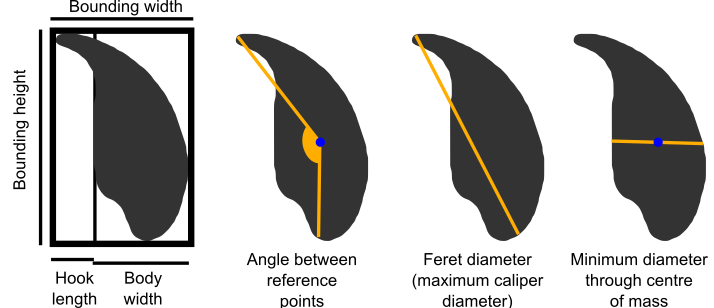

# Background {#intro}

## Angle profiling

Background to the analysis method, and profiling

## What we measure in nuclei {#measurements}

These values are automatically calculated for nuclei. They are:

Measurement | Dimension | Formula | Description
----------|------|------|------------
Area | Area | | the two dimensional area of the nucleus
Perimeter | Length | | the length of the nuclear perimeter
Max feret | Length | | the maximum caliper diameter across the nucleus
Min diameter | Length | | the shortest diameter through the centre of mass of the nucleus
Variability | Angle | | the square root of the sum-of-squares difference at each index between between the nuclear profile and the dataset median profile, normalised to the length of the median profile.
Ellipticity | None | `H/W` | the height divided by width of the nuclear bounding box in the vertically oriented nucleus
Aspect ratio | None | `W/H` | the inverse of ellipticity
Elongation | None | (`H-W`)/(`H+W`) | the bounding height minus the bounding width, divided by the bounding height plus the bounding width
Regularity | None | (`pi*H*W`)/(`4*area`) | A measure of how regular the shape is; does it have rotational symmetry
Circularity | None | ```(4*pi*area)/(perimeter^2)``` | the closeness of the nucleus to a circle, between 0 and 1, where 1 is a perfect circle.
Bounding width | Length | | the width of the bounding rectangle of the nucleus, after rotation to vertical
Bounding height | Length | | the height of the bounding rectangle of the nucleus, after rotation to vertical
Length of hook [rodent sperm only] | Length | | the distance from the vertical region defined by the top and bottom vertical points to the lower x-edge of the bounding rectangle of the vertically oriented nucleus
Width of body [rodent sperm only] | Length | | the distance from the vertical region defined by the top and bottom vertical points to the upper x-edge of the bounding rectangle of the vertically oriented nucleus

```{r, out.width="100%", out.height="100%", fig.show='hold', echo=F}

```

## What we measure in FISH signals {#signal-measurements}

These values are automatically calculated for FISH signals. They are:
