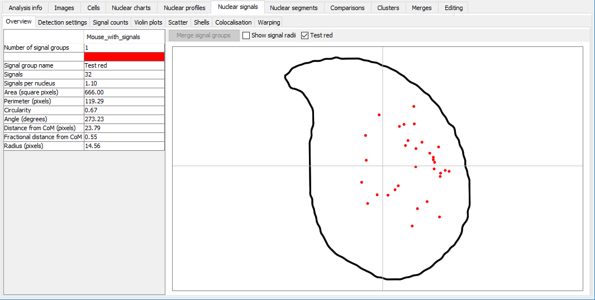

# Running analyses

This section describes how to run a basic analysis, and some other common tasks.

## New analysis {#new-analysis}

There are several ways to start new morphology analysis:

- By dragging a folder of images onto the software 

- By selecting 'File>New analysis>Use custom detection options' in the menu; you will be then asked to select a folder of images to be analysed. 

- By selecting 'File>New> analysisUse saved detection options' in the menu; you will be then asked to select a settings file, then a folder of images to be analysed. 

The guide below uses a testing set of images, which you can download as a [zipped folder](https://bitbucket.org/bmskinner/nuclear_morphology/downloads/Testing_mouse_image_set.zip).

When starting an analysis using options (1) or (2), the following setup screen is shown. To help you choose appropriate settings, the images on the right show the pipeline for detecting objects in the first image of the folder selected. Each image enlarges when clicked. If you are happy with the result, select 'Proceed with analysis', otherwise adjust the settings. The images will be updated every time you change a setting. The 'Prev' and 'Next' buttons allow nucleus detection to be run on successive images in the folder(s).

```{r, out.width="100%", out.height="100%", fig.show='hold', fig.align='center', echo=F}

```

The settings panel contains the following sections:

### Copying settings

At the top of the window are 'From dataset' and 'From file' buttons. These allow nucleus detection settings to be copied from another source. 

'From dataset' will only be available is an another dataset is open in the software when you are creating the new analysis. Clicking it will provide a list of open datasets, from which you can choose a dataset to copy detection settings from. 

'From file' will open a file chooser so you can select a saved settings file. 

### Image

Set information about the images to be analysed.

Setting | Controls
--------|----------
H&E | Is the image H&E stained, or fluorescence?
Channel | The RGB colour channel containing the nuclei (set to Greyscale if the image is black and white)
Scale | The number of pixels per micron. Allows the real size of images to be entered, so measurements can be presented in microns as well as in pixels. This can be set after an analysis is complete, so don't worry if you don't have this value to hand immediately. If you constantly use the same value (e.g. you only process data from one microscope) you can set is as the default in the configuration file.

### Preprocessing

Set options for removing background.

Setting | Controls
--------|----------
Kuwahara filter | [This smoothing filter](https://en.wikipedia.org/wiki/Kuwahara_filter) is better at preserving edges than the standard Gaussian filter. If enabled, the kernel size must be an odd number
Kuwahara kernel | If enabled, the kernel size must be an odd number
Flatten chromocentres | Bright internal structures can cause the edge detector to pick the wrong feature as the nucleus outline. This option sets any pixels brighter than the threshold value to equal the threshold, thereby removing bright peaks.
Flattening threshold | The value to use for chromocentre flattening

### Object finding

Setting | Controls
--------|----------
Threshold | Uses an absolute signal intensity cutoff to decide what is a nucleus and what is not.
Edge detection | Uses the [Canny edge detection](https://en.wikipedia.org/wiki/Canny_edge_detector) method to find edges in the image. 
Canny low threshold | Suppress weak edge pixels due to noise lower than this value. The default value was empirically chosen to work on mouse sperm images.
Canny high threshold | Suppress weak edge pixels due to noise higher than this value. The default value was empirically chosen to work on mouse sperm images.
Canny kernel radius | The radius for [Gaussian blurring](https://en.wikipedia.org/wiki/Gaussian_blur?searchDepth=1). The radius of the Gaussian convolution kernel used to smooth the source image prior to gradient calculation. The default value is 16.
Canny kernel width | The number of pixels across which the Gaussian kernel is applied. The included implementation will reduce the radius if the contribution of pixel values is deemed negligable, so this is actually a maximum radius. Must be at least 2.
Gap closing radius | The radius of the circle used for [morphological closing](https://en.wikipedia.org/wiki/Closing_%28morphology%29).
Watershed | If your nuclei are close together or partially overlapping, e.g. from cell culture, this will use [watershed segmentation](https://en.wikipedia.org/wiki/Watershed_segmentation) to separate individual cells. Note that this is primarily designed for round nuclei, and the effect on asymmetric nuclei may not be what you want!

### Filtering

Once potential nuclei have been detected by thresholding or edge detection, it must be decided whether they are really nuclei. These settings filter the objects on size and shape.

Setting | Controls
--------|----------
Min and max area | constraints on the size of the detected nuclei. 
Min and max circ | constraint on [circularity](https://en.wikipedia.org/wiki/Roundness_%28object%29). A value of 1 is a perfect circle; a value of zero is entirely non-circular.

### Profiling

Setting | Controls
--------|----------
Nucleus type | A dropdown list to select the type of nucleus being analysed. Defaults to the value in the program [config file](https://bitbucket.org/bmskinner/nuclear_morphology/wiki/ui/Config%20options). The choice of nucleus type determines the rules that will be used to identify points of interest in the nucleus. New rule definitions can be added.
Profile window | The window size used to generate morphology profiles. Too low, and you won't detect any features of interest. Too high, and you get enough resolution. The profile window is set as a faction of the perimeter of each nucleus, from zero to one. The default value is 5% of the perimeter, 0.05. The effect of the window size can be seen in the description of the angle window explorer [here](https://bitbucket.org/bmskinner/nuclear_morphology/wiki/ui/Angle%20window%20size%20explorer). The angle window can be altered after an analysis has been run.
Apply rulesets | A dropdown list to select how the landmarks should be assigned. This should remain on 'Via median' in almost all instances. The other option, 'Per nucleus', does not use the median angle profile to help identify unclear landmarks in individual nuclei.


### Start the analysis

When ready, click the 'Proceed with detection' button in the lower right to be begin finding nuclei. A progress bar in the upper left of the screen (above the log panel) shows the progress through the images in the selected folder. If no nuclei are found in any of the images, no datasets will be returned. If nuclei were detected, they will be analysed, and the new population will appear in the populations panel.

```{r, out.width="100%", out.height="100%", fig.show='hold', fig.align='center', echo=F}
knitr::include_graphics("img/gifs/New_analysis.gif")
```


## Curating and filtering nuclei {#curating-method}

Filtering is a quick way to exclude cells with poor edge detection, or simply to pull out a group of interest to you. Filtering can be performed from the [Nuclear charts scatter tab](#nuclear-charts-tab).

Choose the parameters you want to filter on using the drop-down menus for the X and Y axes of the chart. The defaults are area and difference to the median profile; this usually shows outsized and oddly shaped nuclei quite clearly.

The nuclei can be filtered using the 'Filter visible' button. Zoom to a region on the chart so only a subset of the nuclei are visible, then click the 'Filter visible' button. A new child dataset will be created containing only the nuclei currently visible on the graph.

```{r, out.width="100%", out.height="100%", fig.show='hold', fig.align='center', echo=F}
knitr::include_graphics("img/gifs/Filter_collection.gif")
```

## Modifying landmarks and segments  {#updating-landmarks-method}

Landmarks and segments can be altered for individual cells, and for the dataset as a whole. For individual cells, see the [cells tab](#cells-tab). To edit segments or landmarks across the entire dataset, see the [editing tab](#editing-tab).

## Clustering nuclei {#clustering-method}

See the [Clusters tab](#clusters-tab).

## Detecting FISH signals {#detect-signals-method}

Once a dataset has been created (either by a new analysis or loading an existing dataset), an attempt can be made to find nuclear signals.

- Select 'Dataset > Add > Add nuclear signal'. 
- You will be asked to choose a folder containing the images with signals. 
- A detection window will then be displayed, similar to the new analysis setup. 
- The outlines of nuclei detected previously will be shown in blue, and the detected signals will be outlined in yellow (if they meet filtering criteria) or red (if they fail to meet filtering criteria).

### Image

Set information about the images to be analysed.

Setting | Controls
--------|----------
H&E | Is the image H&E stained, or fluorescence?
Channel | The RGB colour channel containing the signal (set to Greyscale if the image is black and white)
Scale | The number of pixels per micron. Allows the real size of images to be entered, so statistics can be presented in microns as well as in pixels. This can be updated after an analysis is complete. By default, this is copied from the nuclei.

### Thresholding

Setting | Controls
--------|----------
Threshold | The pixels must be equal to or brighter than this to be counted

### Object finding

Setting | Controls
--------|----------
Method | One of the available methods for finding a signal, described below and in the dialog window.
Forward | Takes all objects with pixels over the threshold, meeting the size requirements. If there is a lot of bright background, it can mistake this for signal. 
Reverse | Starts with the brightest pixels (intensity 255), and tries to detect objects meeting size and shape criteria. If it fails, it looks at pixels with intensity 254 or above. This recurses until either a signal is found, or the signal threshold is reached. 
Adaptive | The intensity histogram within the nuclear bounding box is trimmed to the minimum signal threshold defined in the options, then scanned for the position with maximum dropoff (formally, in the delta profile, the local minimum (a) below zero (b) with an absolute value greater than 10% of the total intensity range of the trimmed profile (c) with the highest index). Since this position lies in the middle of the dropoff, a (currently) fixed offset is added to the index to remove remaining background. This index is used as the new threshold for the detector. If a suitable position is not found, we fall back to the minimum signal threshold defined in the options.

### Filtering

Setting | Controls
--------|----------
Min area | Signals must have an area in pixels greater than this
Max fraction | The signal cannot be larger than this fraction of the nuclear area
Min and max circ | Circularity measures (see nucleus detection). Default is to accept anything.

### Start the analysis

When ready, click the 'Proceed with detection' button in the lower right to be begin finding signals.

**The images must have the same names as the DAPI images from which the nuclei were originally found.** i.e., if a nucleus came from an image named `P22.tif`, the signal must also be in an image named `P22.tif`

After the signal detection has run, a new child dataset is created for the subset of nuclei with signals detected. Nuclear signals can be viewed in the [Nuclear signals tab](#nuclear-signals-tab).

```{r, out.width="100%", out.height="100%", fig.show='hold', fig.align='center', echo=F}

```

## Warping signals {#warp-signals-method}

The signals overview tab shows an aggregate of the positions of nuclear signals. However, this is just based on drawing circles of about the right size at the position of the signal centre of mass:

```{r, out.width="100%", out.height="100%", fig.show='hold', fig.align='center', echo=F}

```

Irregularly shaped signals may look different, especially if the shape of the nucleus is also quite different. Signal warping can be used to fit the signals from one nucleus onto the shape of another nucleus. The method is described in more detail in [our paper](https://www.ncbi.nlm.nih.gov/pubmed/30717218).

When warping signals, there are two choices to make:

- the signal group to be warped - these are the particular nuclei and FISH signals you want to warp
- the consensus nucleus shape to warp the signals onto; this can be from the same dataset as the signals, or a different dataset

### How to warp signals

- Ensure that the dataset containing the signals and the dataset with the target consensus shape have the same segmentation pattern. Warping relies on the segments to determine which regions of the nuclei are structurally equivalent, so if the segments don't match, this won't work.
- Select the dataset containing the signals you want to warp.
- Select 'Dataset > Add > Warping of signals'. The button will be greyed out if the selected dataset is not suitable for warping.

- The signal warping options will open

```{r, out.width="100%", out.height="100%", fig.show='hold', fig.align='center', echo=F}

```

Option | Affects
-----|------
Signal group | The FISH signal group to use

Min threshold | Threshold signal images before warping; removes any signal below the given threshold. This can help to remove background if the images are very noisy. The default value is the threshold initially used for signal detection.
Binarise | Should images be converted to binary before warping. This can help avoid skewing due to different signal intensities in the images.
Normalise to counterstain | Adjusts signal intensity relative to the nuclear counterstain before warping. Can help make faint signals more obvious
Only include cells with signals | If selected, only warp nuclei for which signals were detected, and are drawn in the nuclear signal overview chart. This allows an extra level of background filtering. Untick if you know your signals were difficult to detect.
Target dataset | The consensus shape to warp signals onto. This will only show datasets that have a compatible segmentation pattern.


- Once you have set up the analysis, click 'OK'. When the warping is complete, the warped result will be added to the table.

### Visualising warped signals

- Click a row in the table to load the warped image. Images can be adjusted via the header options.


Option | Affects
-----|------
Pseudocolour signals | If ticked, the warped signal will be pseudocoloured with the signal group colour (this can be changed in the signal overview tab by double clicking the signal group colour). If unticked, the warped signal will be drawn in greyscale, with black representing the most intense signal. If multiple warped signals are selected, pseudocolours help show the overlap of territories.
Threshold slider | Apply a minimum threshold to a warped signal to explore the region of greatest signal intensity. The default is to have no threshold

- Select multiple rows to see a composite image of the warped signals

- If at least two warped images onto the same target shape are present, the  multi-scale structural similarity index between them will be calculated and displayed in the panel header

### Exporting warped signals

Images can be exported using the 'buttons in the display settings panel:'Export image' button. If two warped signals are selected, the default is to assign each warped image a colour designed to highlight similarities and differences between the images. These colours may be different to the image displayed in the warper, which use the signal group pseudocolours. Choose a colour pair you prefer via the drop down list. If you want the exported image to have the consensus nucleus outline, tick the box.

```{r, out.width="100%", out.height="100%", fig.show='hold', fig.align='center', echo=F}

```

### Comparing warped images

If two warped images with the same target shape are selected, the multi-scale structural similarity index (MS-SSIM) will be calculated between them. This is a value between 0 and 1, in which identical images have a value of 1, and images with no similarities have a value of 0.

An existing implementation of MS-SSIM is used for this; see the [paper by Renieblas _et al._, 2017](https://www.ncbi.nlm.nih.gov/pmc/articles/PMC5527267/).

The MS-SSIM is displayed at the top of the warping tab. More detail can also be found by clicking the 'Full MS-SSIM' button, which will open a new dialog displaying the full breakdown of components making up the MS-SSIM score (luminance, contrast, structure). 

## Exporting data {#export-data-method}

To export raw data for single or multiple datasets, select the datasets you want to export, and choose `Dataset > Export...`

There are several options available depending on what data you need. If a single dataset is selected, the measurements will be exported to a file of your choice. By default, the file will be in the dataset's folder:
_e.g._ if the dataset is saved to `C:\folder\2017-04-11_12-00-00\Dataset.nmd` then the default output file will be `C:\folder\2017-04-11_12-00-00\Dataset.txt`

If multiple datasets are selected, the combined measurements will be exported to a file of your choice. By default, the file will be called `Multiple_stats_export.txt`.

Columns are usually separated by tabs.

Option | Action
-------|----------
Nuclear measurements | The measured values for each nucleus, plus normalised profiles
Full nuclear profiles | The non-normalised angle profile values for each nucleus. Since there are a different number of values in each nucleus, they are combined into a single column, separated by commas for later parsing
Full nuclear outlines | The X and Y coordinates of each border point in the outline of each nucleus. Since there are a different number of values in each nucleus, they are combined into a single column. XY pairs are separated by commas for later parsing. Within each pair, X and Y values are separated by a pipe  (`|`) e.g. `12.4|3.6,12.9|4.0`.
Nuclear signal measurements | The measured values for each nuclear signal
Nuclear signal shells | The measured nuclear signal in each shell, following shell analysis
Cell locations within images | The XY coordinates of nucleus centres-of-mass within their source image
Consensus nuclei as SVG | The consensus nucleus outlines for all selected datasets in SVG so you can make custom figures
Single cell images | Export each nucleus as a separate image to a folder in the same directory as the `nmd` file. You will be given the option to mask out background; if this is selected, any pixels not within the nucleus will be set to black.
Dataset analysis options | The options used to analyse this dataset in XML format. This can be used directly to set up subsequent analyses
Landmark rulesets | The rules used to detect landmarks, so you can modify them for custom nucleus types


