# How-to guide

This section describes how to run an analysis, and some of the other common tasks.

## Running a new analysis {#new-analysis}

### Very quick start

- Download and unzip the [folder of test images](https://bitbucket.org/bmskinner/nuclear_morphology/downloads/Testing_mouse_image_set.zip)
- Open the software
- Drag the folder of images onto the software
- Click 'Proceed with detection' to use the default settings (which work fine with these test images)

```{r, out.width="100%", out.height="100%", fig.show='hold', fig.align='center', echo=F}
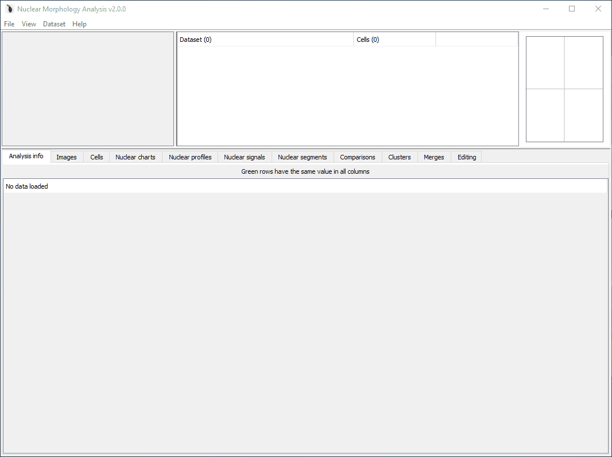
```

### A more detailed start

There are several ways to start new morphology analysis:

- By dragging a folder of images onto the software 

- By selecting 'File > New analysis > Use custom detection options' in the menu; you will be then asked to select a folder of images to be analysed. 

- By selecting 'File > New analysis > Use saved detection options' in the menu; you will be then asked to select a settings file, and a folder of images to be analysed. 

The guide below uses a testing set of images, which you can download as a [zipped folder](https://bitbucket.org/bmskinner/nuclear_morphology/downloads/Testing_mouse_image_set.zip).

When starting an analysis using options (1) or (2), the following setup screen is shown. To help you choose appropriate settings, the images on the right show the pipeline for detecting objects in the first image of the folder selected. Each image enlarges when clicked. If you are happy with the result, select 'Proceed with analysis', otherwise adjust the settings. The images will be updated every time you change a setting. The 'Prev' and 'Next' buttons allow nucleus detection to be run on successive images in the folder(s).

```{r, out.width="100%", out.height="100%", fig.show='hold', fig.align='center', echo=F}
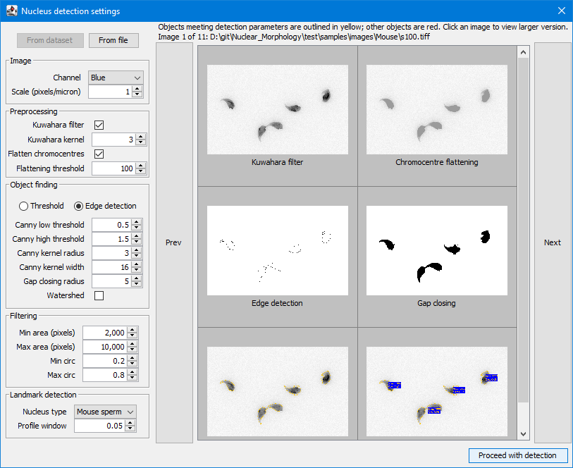
```

The settings panel contains the following sections:

### Copying settings

At the top of the window are 'From dataset' and 'From file' buttons. These allow nucleus detection settings to be copied from another source. 

'From dataset' will only be available is an another dataset is open in the software when you are creating the new analysis. Clicking it will provide a list of open datasets, from which you can choose a dataset to copy detection settings from. 

'From file' will open a file chooser so you can select a saved settings file. 

### Image

Set information about the images to be analysed.

Setting | Controls
--------|----------
H&E | Is the image H&E stained, or fluorescence?
Channel | The RGB colour channel containing the nuclei (set to Greyscale if the image is black and white)
Scale | The number of pixels per micron. Allows the real size of images to be entered, so measurements can be presented in microns as well as in pixels. This can be set after an analysis is complete, so don't worry if you don't have this value to hand immediately. If you constantly use the same value (e.g. you only process data from one microscope) you can set is as the default in the configuration file.

### Preprocessing

Set options for removing background.

Setting | Controls
--------|----------
Kuwahara filter | [This smoothing filter](https://en.wikipedia.org/wiki/Kuwahara_filter) is better at preserving edges than the standard Gaussian filter. If enabled, the kernel size must be an odd number
Kuwahara kernel | If enabled, the kernel size must be an odd number
Flatten chromocentres | Bright internal structures can cause the edge detector to pick the wrong feature as the nucleus outline. This option sets any pixels brighter than the threshold value to equal the threshold, thereby removing bright peaks.
Flattening threshold | The value to use for chromocentre flattening

### Object finding

Setting | Controls
--------|----------
Threshold | Uses an absolute signal intensity cutoff to decide what is a nucleus and what is not.
Edge detection | Uses the [Canny edge detection](https://en.wikipedia.org/wiki/Canny_edge_detector) method to find edges in the image. 
Canny low threshold | Suppress weak edge pixels due to noise lower than this value. The default value was empirically chosen to work on mouse sperm images.
Canny high threshold | Suppress weak edge pixels due to noise higher than this value. The default value was empirically chosen to work on mouse sperm images.
Canny kernel radius | The radius for [Gaussian blurring](https://en.wikipedia.org/wiki/Gaussian_blur?searchDepth=1). The radius of the Gaussian convolution kernel used to smooth the source image prior to gradient calculation. The default value is 16.
Canny kernel width | The number of pixels across which the Gaussian kernel is applied. The included implementation will reduce the radius if the contribution of pixel values is deemed negligable, so this is actually a maximum radius. Must be at least 2.
Gap closing radius | The radius of the circle used for [morphological closing](https://en.wikipedia.org/wiki/Closing_%28morphology%29).
Watershed | If your nuclei are close together or partially overlapping, e.g. from cell culture, this will use [watershed segmentation](https://en.wikipedia.org/wiki/Watershed_segmentation) to separate individual cells. Note that this is primarily designed for round nuclei, and the effect on asymmetric nuclei may not be what you want!

### Filtering

Once potential nuclei have been detected by thresholding or edge detection, it must be decided whether they are really nuclei. These settings filter the objects on size and shape.

Setting | Controls
--------|----------
Min and max area | constraints on the size of the detected nuclei. 
Min and max circ | constraint on [circularity](https://en.wikipedia.org/wiki/Roundness_%28object%29). A value of 1 is a perfect circle; a value of zero is entirely non-circular.

### Landmark detection

Setting | Controls
--------|----------
Nucleus type | A dropdown list to select the type of nucleus being analysed. The choice of nucleus type determines the rules that will be used to identify landmarks in the nucleus. The rulesets listed correspond to the files in the [rulesets folder](#config-rulesets). Custom rule definitions can be added by the user.
Profile window | The window size used to generate morphology profiles. Too low, and you won't detect any features of interest. Too high, and you get enough resolution. The profile window is set as a faction of the perimeter of each nucleus, from zero to one. The default value is 5% of the perimeter, 0.05. The effect of the window size can be seen in the angle window explorer via the [Editing tab](#editing-tab). The angle window can be altered after an analysis has been run.

### Start the analysis

When ready, click the 'Proceed with detection' button in the lower right to be begin finding nuclei. A progress bar in the upper left of the screen (above the log panel) shows the progress through the images in the selected folder. If no nuclei are found in any of the images, no datasets will be returned. If nuclei were detected, they will be analysed, and the new population will appear in the populations panel.

## Curating and filtering nuclei {#curating-filtering-method}

The edge detection and segmentation to find nuclei does not always work perfectly, and so cells can be included in a dataset that have wonky outlines. This can throw off the angle profiling and make datasets look more variable than they truely are. To help avoid this, there are two ways to select only the cells you care about.

### Filtering cells {#filtering-cells-method}

Filtering is a quick way to exclude cells with poor edge detection, or simply to pull out a group of interest to you. Filtering can be performed from the [Nuclear charts scatter tab](#nuclear-charts-tab).

Choose the parameters you want to filter on using the drop-down menus for the X and Y axes of the chart. The defaults are area and difference to the median profile; this usually shows outsized and oddly shaped nuclei quite clearly.

The nuclei can be filtered using the 'Filter visible' button. Zoom to a region on the chart so only a subset of the nuclei are visible, then click the 'Filter visible' button. A new child dataset will be created containing only the nuclei currently visible on the graph.

```{r, out.width="100%", out.height="100%", fig.show='hold', fig.align='center', echo=F}
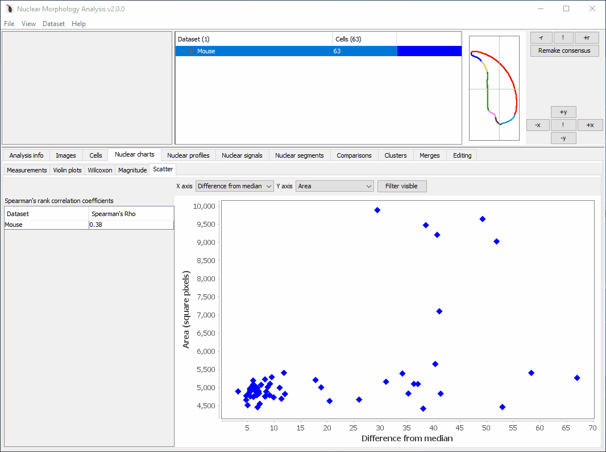
```


### Curating cells {#curating-cells-method}

Manual curation allows you to accept or reject each cell in a dataset. Acceptable cells are copied to a new dataset and reanalysed. The old dataset is not affected. Select a dataset, then choose `Dataset > Curate`. A window will be displayed showing all the nuclei in the dataset oriented.

In the example below, the first four cells in the dataset (`s100.tiff-35` to `s100.tiff-38`) have errors. One is two nuclei overlapping, and the other three have errors in the edge detection. We want to remove these cells from our curated dataset.

```{r, out.width="100%", out.height="100%", fig.show='hold', fig.align='center', echo=F}
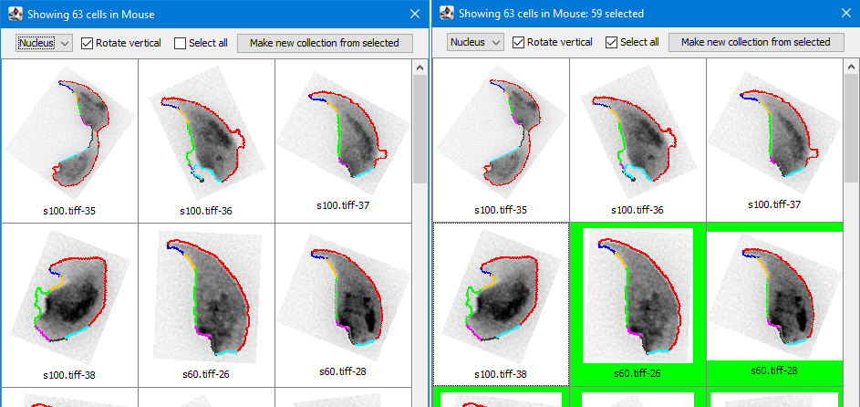
```

Select the nuclei to keep; the table background will turn green for selected nuclei. Use the 'Select all' option as a shortcut if you only need to skip a few nuclei, as in the right image above. You can also deselect the 'Rotate vertical' option to show the nuclei as they appear in their source image.. 

Once you are happy with your selection, click the  `Make new collection from selected` button at the top of the window, and the chosen cells will be added to a new dataset.

For large datasets, it may take some time to load the image for all the nuclei. The loading progress is shown by a loading bar at the bottom of the window.

## Modifying landmarks and segments  {#updating-landmarks-method}

Landmarks and segments can be altered for individual cells, and for the dataset as a whole. For individual cells, see the [cells tab](#cells-tab). To edit segments or landmarks across the entire dataset, see the [editing tab](#editing-tab).

## Merging and combining datasets {#merges-boolean-methods}

### Merging two datasets {#merge-method}

To merge datasets, select them in the [populations panel](#populations-panel), and choose `Dataset > Merge'. You will be asked to choose a file to save the new merged dataset. The merge will run, and a new morphological analysis will be carried out on the merged dataset.

When a merged dataset is selected, the [merges tab](#merges-tab) displays the analysis options for each of the merge sources within the dataset.

To recover a source dataset back out of a merged dataset, click the appropriate `Recover source` button, at the bottom of the panel.

### Boolean logical combinations of datasets {#boolean-method}

These are invoked via `Datasets > Boolean`. They allow a boolean algebraic operation on the cells between two datasets. A new dataset is created containing the cells that meet the criterion. The most common use case is to allow subsetting of datasets using different filtering, clustering or signal child datasets to get a specific combination of cells.

The available options are:

Operation | Condition
-------|-------
`AND` | the cell is present in both datasets
`OR` | the cell is present in either dataset (same as [merging datasets](#merge-method))
`NOT` | the cell is in dataset one, but not dataset two
`XOR` | the cell is in either dataset one or dataset two, but not both


## Clustering nuclei {#clustering-method}

We often want to explore the variation in nuclei within a dataset; perhaps there are two or more distinct groups of shapes to find. To do this, we can perform clustering, based on the profiles or other measured values.

Clustering is visualised through the [Clusters tab](#clusters-tab). There are three ways to generate clusters:

- Manually
- Automatically, using a clustering algorithm
- Importing a file containing clusters 

### Manual clustering

Allows nuclei to be manually assigned to clusters. 

- Select `Datasets > Add > Clustering manually`. 
- Choose the number of clusters you want to make, and their names
- Each nucleus will be displayed with a button to choose which cluster to put it in

```{r, out.width="100%", out.height="100%", fig.show='hold', fig.align='center', echo=F}
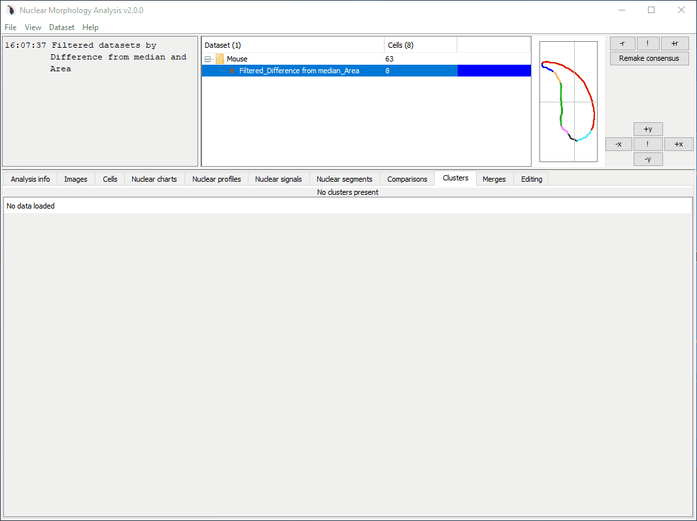
```

### Automatic clustering

Allows nuclei to be assigned to clusters based on their shape, or other measurements. 

- Select `Datasets > Add > Clustering automatically`
- Choose the nuclear parameters to cluster on
- Choose whether to perform dimensionality reduction
- Choose the clustering method

```{r, out.width="100%", out.height="100%", fig.show='hold', fig.align='center', echo=F}
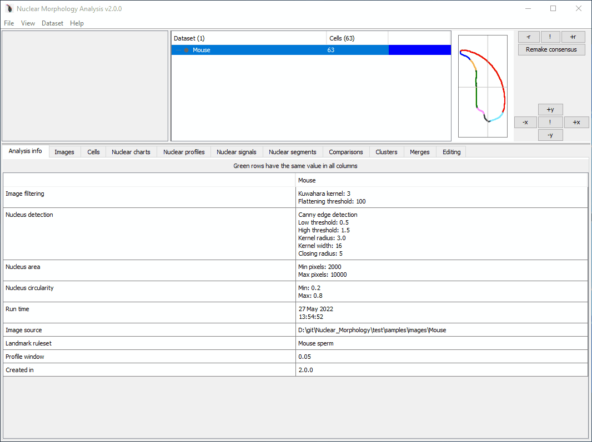
```

The default clustering is on the profile angles within each nucleus. Checkboxes allow selection of other nuclear parameters.

#### Dimensionality reduction

Dimensionality reduction can be optionally applied before clustering. PCA, tSNE and UMAP are provided; however, for reproducibile analysis it is recommended that you export the measurements and run these in your preferred stats package. tSNE especially makes use of a random number generator, and so generates a slightly different plot every time you run it. This can be controlled with fixed seeds in stats programs like R.

You can choose whether or not to use the dimensionality reduction values for clustering. The default is to cluster directly on the parameters, and use the dimensionality reduction purely for visualisation.

If dimensionality reduction was applied, after clustering is complete, the first two dimensions can be viewed in a scatter plot by clicking the `View plot` button in the cluster parameters table. This will also display the consensus nuclei of each cluster, and overlay a random subset of nucleus images to help you see what actually separates your clusters.

```{r, out.width="80%", out.height="80%", fig.show='hold', fig.align='center', echo=F}
knitr::include_graphics("img/Clusters_UMAP.PNG")
```

#### Clustering method

Clustering can be performed using [hierarchical clustering](https://en.wikipedia.org/wiki/Hierarchical_clustering) or [expectation maximisation](https://en.wikipedia.org/wiki/Expectation%E2%80%93maximization_algorithm) clustering. 

- Hierarchical clustering will link the cells that are most similar, building a tree. The number of clusters you get is pre-determined; cluster assignments for $n$ clusters are made by slicing the tree at the point where there are $n$ branches. This may be more useful if you know the number of groups you expect to find.
- EM clustering is a variant of K-means clustering that tries to determine the best number of clusters itself. This may be more useful if you are trying to discover novel variation in a sample.

Once clustering is complete, if hierarchical clustering was selected, a `Show tree` button will be available. Clicking this button will launch the tree viewer.

```{r, out.width="80%", out.height="80%", fig.show='hold', fig.align='center', echo=F}
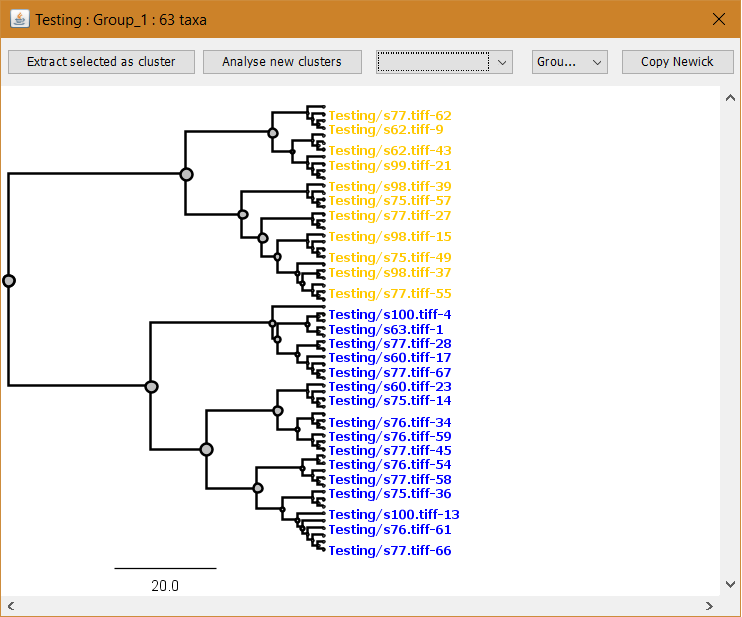
```

The tree can be highlighted to show cluster memberships. The first dropdown list selects individual clusters to highlight. The second selects cluster groups to highlight. If the dataset has merge sources, these can be applied as a highlight using the "Show merge sources" button.

The [Newick format](https://en.wikipedia.org/wiki/Newick_format) for the cluster tree can be copied using the 'Copy Newick', for use in other tree editing software.

### Importing clusters {#import-cluster-method}

Sometimes you may want to run clustering on exported data, for example in R, and then use NMA to create the average shape of each cluster. To do this, we can import a file that maps each cell to a cluster.

The R code snippet below demonstrates how to export a cluster file from within R:

```{r, eval=F, echo=T}
# This assumes you have created a column "ClusterID" in your data frame
# with the cluster assignments. The ClusterID column should contain
# integers from 1.
  map.data <- sample.data %>% dplyr::select(CellID, ClusterID)

  write.table(map.data, file = "cluster_map.tsv", sep = "\t", row.names = F, col.names = F, quote = F)
```

The mapping file created should be a tab-separated file, containing the cell id, and the cluster number to which the cell is assigned. No column headers are needed. An example is shown below:

```{}
33e148a2-9239-43e4-9116-7fb9cfd3f170	1
3670723b-185f-4b47-95db-4040b0349d3a	1
4cf346dd-77a3-4533-9565-cc43ec5db0bd	1
77709677-65b4-43d6-912c-182858d904db	1
94701494-ebca-491d-b65d-03ab52478be7	2
2ffb047a-c4eb-41a0-96ae-05e388b0bfdc	2
2610caa7-8456-46b6-b26a-6b87f5c42847	2
8683deb7-0c7c-474c-b895-e34a0cd2ef36	2
7eeabe40-c860-4244-9910-23ce7af6e76e	2
```

To add the clusters, select `Datasets > Add > Clustering from file`. Select your mapping file, and the clusters will be applied as a new cluster group.

```{r, out.width="100%", out.height="100%", fig.show='hold', echo=F}
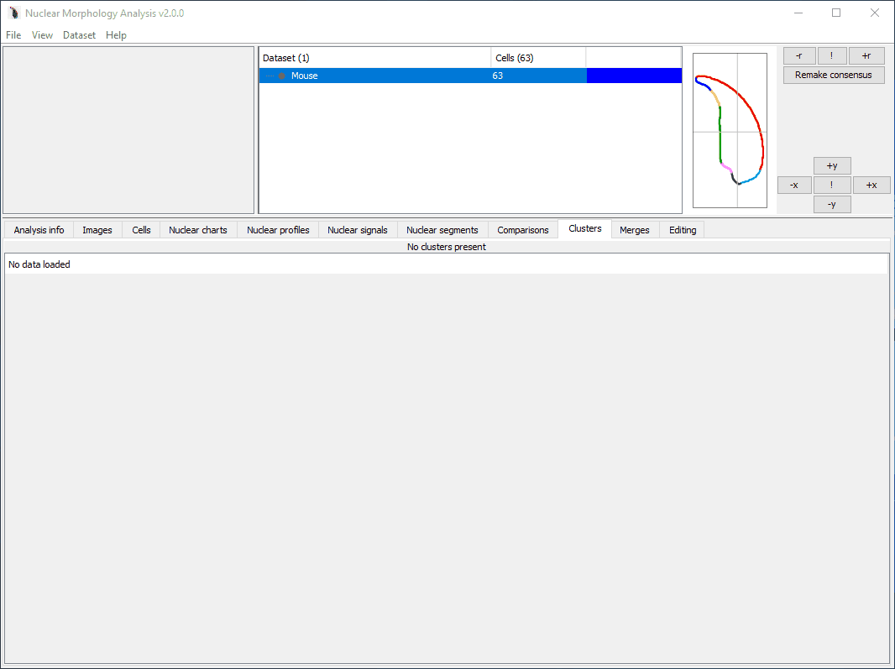
```

## Detecting FISH signals {#detect-signals-method}

Once a dataset has been created (either by a new analysis or loading an existing dataset), we can try to find nuclear signals.

### Very briefly

- Select 'Dataset > Add > Add nuclear signal'
- Choose the folder containing the images with signals
- A detection window will be displayed, similar to the new analysis setup. 
- Outlines of nuclei detected previously will be shown in blue, and detected signals will be outlined in yellow (if they meet filtering criteria) or red (if they fail to meet filtering criteria)
- Once happy with the settings, click 'Proceed with detection'
- Provide a name for the signal group

```{r, out.width="100%", out.height="100%", fig.show='hold', fig.align='center', echo=F}
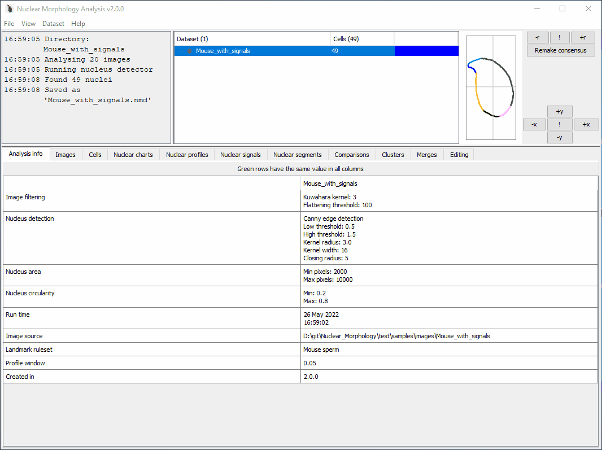
```

### More detail

The images containing FISH signals can be, but do not need to be, the same images containing the nuclei. This means you could have images with (_e.g._) DAPI stained nuclei in the blue channel, and FISH signals in the red or green channels. You could also have one folder of RGB or greyscale images with the DAPI stained nuclei, and another folder of RGB or greyscale images with the FISH signals.

The software determines which nucleus a signal belongs to using the image file name. If you use separate folders of images for nuclei and signals, **the signal images must have the same names as the images from which the nuclei were originally found.**.

For example, here is an analysis with separate folders for each. If a nucleus came from the image named `Image 1.tif`, the signal must also be in an image named `Image 1.tif`:

```{}
Main folder
  |- DAPI folder
  |  |- Image 1.tiff
  |  |- Image 2.tiff
  |- Red signals folder
     |- Image 1.tiff
     |- Image 2.tiff
```

### Image

Set information about the images to be analysed.

Setting | Controls
--------|----------
H&E | Is the image H&E stained, or fluorescence?
Channel | The RGB colour channel containing the signal (set to Greyscale if the image is black and white)
Scale | The number of pixels per micron. Allows the real size of images to be entered, so statistics can be presented in microns as well as in pixels. This can be updated after an analysis is complete. By default, this is copied from the nuclei.

### Thresholding

Setting | Controls
--------|----------
Threshold | The pixels must be equal to or brighter than this to be counted

### Object finding

Setting | Controls
--------|----------
Method | One of the available methods for finding a signal, described below and in the dialog window.
Forward | Takes all objects with pixels over the threshold, meeting the size requirements. If there is a lot of bright background, it can mistake this for signal. 
Reverse | Starts with the brightest pixels (intensity 255), and tries to detect objects meeting size and shape criteria. If it fails, it looks at pixels with intensity 254 or above. This recurses until either a signal is found, or the signal threshold is reached. 
Adaptive | The intensity histogram within the nuclear bounding box is trimmed to the minimum signal threshold defined in the options, then scanned for the position with maximum dropoff (formally, in the delta profile, the local minimum (a) below zero (b) with an absolute value greater than 10% of the total intensity range of the trimmed profile (c) with the highest index). Since this position lies in the middle of the dropoff, a (currently) fixed offset is added to the index to remove remaining background. This index is used as the new threshold for the detector. If a suitable position is not found, we fall back to the minimum signal threshold defined in the options.

### Filtering

Setting | Controls
--------|----------
Min area | Signals must have an area in pixels greater than this
Max fraction | The signal cannot be larger than this fraction of the nuclear area
Min and max circ | Circularity measures (see nucleus detection). Default is to accept anything.

### Start the analysis

When ready, click the 'Proceed with detection' button in the lower right to be begin finding signals.

After the signal detection has run, a new child dataset is created for the subset of nuclei with signals detected. Nuclear signals can be viewed in the [Nuclear signals tab](#nuclear-signals-tab).

## Warping signals {#warp-signals-method}

The signals overview tab shows an aggregate of the positions of nuclear signals. However, this is just based on drawing circles of about the right size at the position of the signal centre of mass:

```{r, out.width="100%", out.height="100%", fig.show='hold', fig.align='center', echo=F}
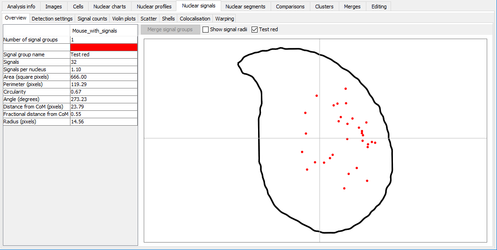
```

Irregularly shaped signals may look different, especially if the shape of the nucleus is also quite different. Signal warping can be used to fit the signals from one nucleus onto the shape of another nucleus. The method is described in more detail in [our paper](https://www.ncbi.nlm.nih.gov/pubmed/30717218).

When warping signals, there are two choices to make:

- the signal group to be warped - these are the particular nuclei and FISH signals you want to warp
- the consensus nucleus shape to warp the signals onto; this can be from the same dataset as the signals, or a different dataset


### Very briefly

```{r, out.width="100%", out.height="100%", fig.show='hold', fig.align='center', echo=F}
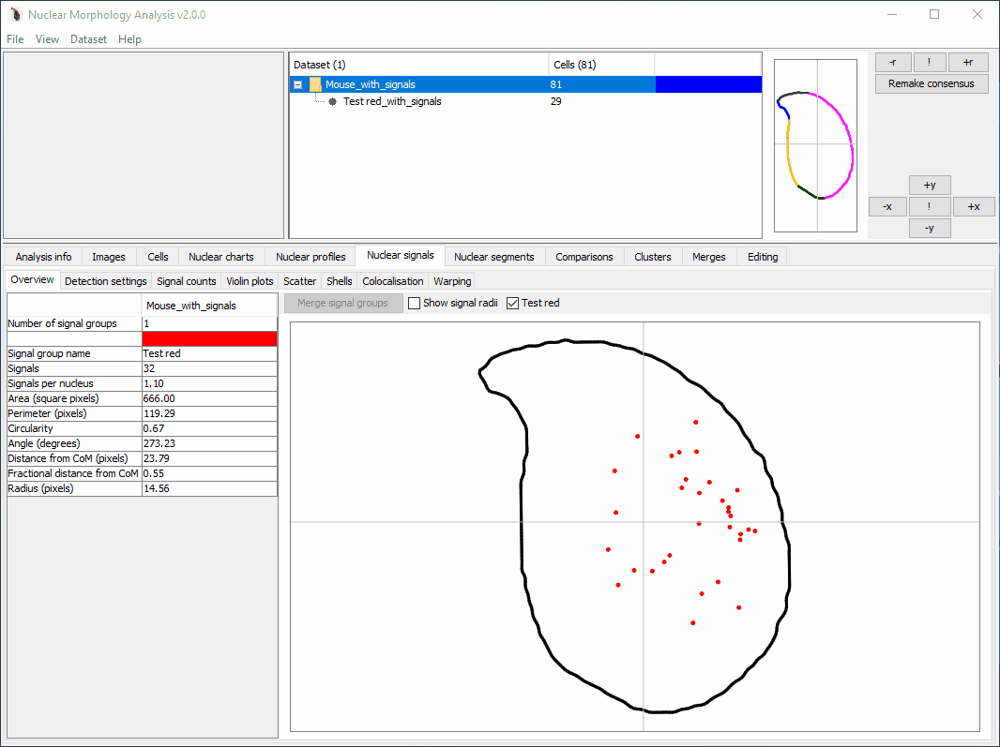
```

### How to warp signals

- Ensure that the dataset containing the signals and the dataset with the target consensus shape have the same segmentation pattern. Warping relies on the segments to determine which regions of the nuclei are structurally equivalent, so if the segments don't match, this won't work.
- Select the dataset containing the signals you want to warp.
- Select 'Dataset > Add > Warping of signals'. The button will be greyed out if the selected dataset is not suitable for warping.

- The signal warping options will open

```{r, fig.show='hold', fig.align='center', echo=F}
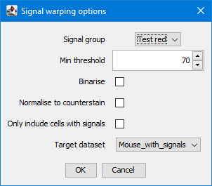
```

Option | Affects
-----|------
Signal group | The FISH signal group to use
Min threshold | Threshold signal images before warping; removes any signal below the given threshold. This can help to remove background if the images are very noisy. The default value is the threshold initially used for signal detection.
Binarise | Should images be converted to binary before warping. This can help avoid skewing due to different signal intensities in the images.
Normalise to counterstain | Adjusts signal intensity relative to the nuclear counterstain before warping. Can help make faint signals more obvious
Only include cells with signals | If selected, only warp nuclei for which signals were detected, and are drawn in the nuclear signal overview chart. This allows an extra level of background filtering. Untick if you know your signals were difficult to detect.
Target dataset | The consensus shape to warp signals onto. This will only show datasets that have a compatible segmentation pattern.


- Once you have set up the analysis, click 'OK'. When the warping is complete, the warped result will be added to the table.

### Visualising warped signals

- Click a row in the table to load the warped image. Images can be adjusted via the header options.


Option | Affects
-----|------
Pseudocolour signals | If ticked, the warped signal will be pseudocoloured with the signal group colour (this can be changed in the signal overview tab by double clicking the signal group colour). If unticked, the warped signal will be drawn in greyscale, with black representing the most intense signal. If multiple warped signals are selected, pseudocolours help show the overlap of territories.
Threshold slider | Apply a minimum threshold to a warped signal to explore the region of greatest signal intensity. The default is to have no threshold

- Select multiple rows to see a composite image of the warped signals

- If at least two warped images onto the same target shape are present, the  multi-scale structural similarity index between them will be calculated and displayed in the panel header

### Exporting warped signals

Images can be exported using the 'buttons in the display settings panel:'Export image' button. If two warped signals are selected, the default is to assign each warped image a colour designed to highlight similarities and differences between the images. These colours may be different to the image displayed in the warper, which use the signal group pseudocolours. Choose a colour pair you prefer via the drop down list. If you want the exported image to have the consensus nucleus outline, tick the box.

### Comparing warped images

If two warped images with the same target shape are selected, the multi-scale structural similarity index (MS-SSIM) will be calculated between them. This is a value between 0 and 1, in which identical images have a value of 1, and images with no similarities have a value of 0.

An existing implementation of MS-SSIM is used for this; see the [paper by Renieblas _et al._, 2017](https://www.ncbi.nlm.nih.gov/pmc/articles/PMC5527267/).

The MS-SSIM is displayed at the top of the warping tab. More detail can also be found by clicking the 'Full MS-SSIM' button, which will open a new dialog displaying the full breakdown of components making up the MS-SSIM score (luminance, contrast, structure). 


## Remapping cells after FISH {#post-fish-mapping-method}

If you have images of nuclei taken before and after FISH, you can use the FISH images to sort pre-FISHED images into groups. This is how we analysed the shapes of X- and Y-bearing sperm separately in [our paper on a Yq-deletion mutant](https://www.ncbi.nlm.nih.gov/pmc/articles/PMC6839398/).

- Select the pre-FISH dataset
- Select `Datasets > Add > Post-FISH mapping`  
- Choose the folder of FISH images

The FISH images:

- must be RGB images
- must have the same names as the pre-FISH images (i.e. if you have a pre-FISH image `\Pre FISH Folder\Image1.tiff`, the post-FISH image must have the name `\Post FISH Folder\Image1.tiff`)

A window will display showing the pre- and post-FISH images side by side:

```{r, out.width="100%", out.height="100%", fig.show='hold', fig.align='center', echo=F}
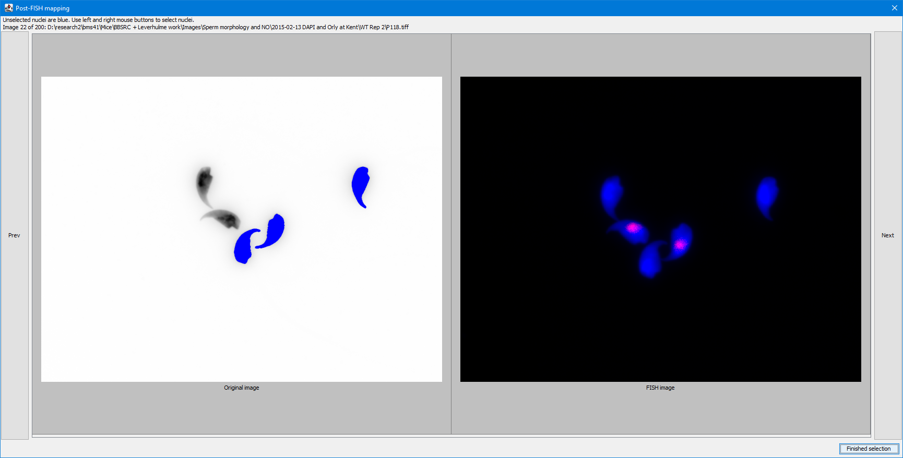
```

If a nucleus from the pre-FISH dataset is present in the current pre-FISH image, it will be coloured blue. Clicking on these nuclei with the left button will turn them green; clicking with the right button will turn them red. Clicking a red or green nucleus with either button will deselect them and they will return to blue.

```{r, out.width="100%", out.height="100%", fig.show='hold', fig.align='center', echo=F}
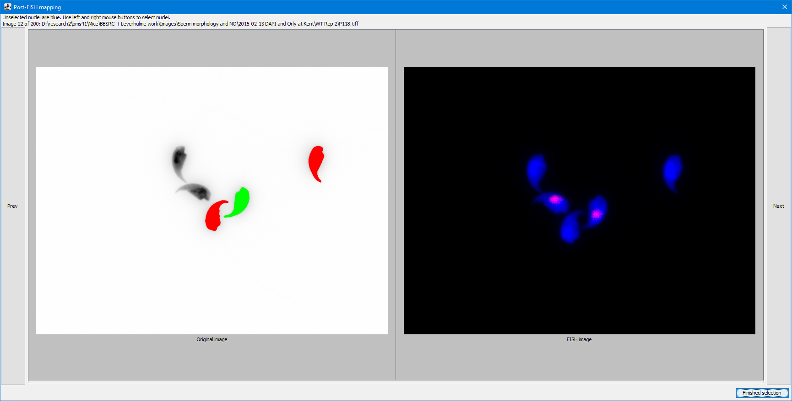
```

- Continue through the images. Use the next and previous buttons to move through all the images, sorting the pre-FISH nuclei into the group(s) you want based on the information in the post-FISH image. You don't have to assign all nuclei to groups. Once you have finished, click the `Finished selection` button in the bottom right.

- The green and red selected nuclei will be added to new child collections named `SubCollectionLeft` and `SubCollectionRight` respectively.

## Exporting data {#export-data-method}

### Saving the charts or tables

Data from all charts and tables can be copied or saved by right clicking, and selecting either `Copy data` or `Export data`. In either case, the underlying data will be copied in tab separated format, suitable for pasting into Excel or other software.

The charts can be saved as images via right clicking and `Save as...`. When it comes to making pretty figures for papers though, I usually recommend exporting the measurements and drawing your own.

### Exporting all measurements

To export raw data for single or multiple datasets, select the datasets you want to export, and choose `Dataset > Export...`

There are several options available depending on what data you need. If a single dataset is selected, the measurements will be exported to a file of your choice. By default, the file will be in the dataset's folder:
_e.g._ if the dataset is saved to `C:\folder\2017-04-11_12-00-00\Dataset.nmd` then the default output file will be `C:\folder\2017-04-11_12-00-00\Dataset.txt`

If multiple datasets are selected, the combined measurements will be exported to a file of your choice. By default, the file will be called `Multiple_stats_export.txt`.

Columns are usually separated by tabs.

Option | Action
-------|----------
Nuclear measurements | The measured values for each nucleus, plus normalised profiles
Full nuclear profiles | The non-normalised angle profile values for each nucleus. Since there are a different number of values in each nucleus, they are combined into a single column, separated by commas for later parsing
Full nuclear outlines | The X and Y coordinates of each border point in the outline of each nucleus. Since there are a different number of values in each nucleus, they are combined into a single column. XY pairs are separated by commas for later parsing. Within each pair, X and Y values are separated by a pipe  (`|`) e.g. `12.4|3.6,12.9|4.0`.
Nuclear signal measurements | The measured values for each nuclear signal
Nuclear signal shells | The measured nuclear signal in each shell, following shell analysis
Cell locations within images | The XY coordinates of nucleus centres-of-mass within their source image
Consensus nuclei as SVG | The consensus nucleus outlines for all selected datasets in SVG so you can make custom figures
Single cell images | Export each nucleus as a separate image to a folder in the same directory as the `nmd` file. You will be given the option to mask out background; if this is selected, any pixels not within the nucleus will be set to black.
Dataset analysis options | The options used to analyse this dataset in XML format. This can be used directly to set up subsequent analyses
Landmark rulesets | The rules used to detect landmarks, so you can modify them for custom nucleus types

### Running downstream analysis on exported data

Once you have exported the data, you can do whatever downstream analysis you wish. This demonstrates a simple example of how to run a tSNE in R, and perform a hierarchical clustering on the result, using the angle profiles from exported nuclear statistics.

```{r, eval=F, echo=T}
# Demonstration of how to read a sample tsv of morphology data, extract the relevant
# columns for the angle profile, run a tSNE, cluster, and display the result
library(tidyverse)
library(Rtsne)
library(cluster)
library(dendextend)

# Read in the input data file
data <- read.csv("Exported_data.tsv", sep="\t", header=T, stringsAsFactors = F)

# Take just the angle profile columns
profiles <- data %>% dplyr::select(one_of(paste0("Angle_profile_", seq(0,99,1))))
  
# Set the rownames of the data using the cell id and the strain for convenience
rownames(profiles) <- data$CellID

# Set the random number generator with a seed for reproducilble results
set.seed(42)

# Run a tSNE on the profile data - the Rtsne function requires a matrix
# Perplexity should be tuned according to the number of samples you have;
# a good starting point is 5% of your sample size
rtsne_out <- Rtsne(as.matrix(profiles), perplexity=20, max_iter=1000)
tsne.values <- as.data.frame(rtsne_out$Y)

# Display the results as a scatter plot
ggplot(tsne.values, aes(x=V1, y=V2))+
  geom_point()

# Cluster the tSNE values using hierarchical clustering
# The agnes function is agglomerative nesting
hc <- cluster::agnes(tsne.values, method = "ward")

# Make a dendrogram (tree) from the cluster data
dend <- as.dendrogram(hc)

# Cut the dendrogram to get 4 separate groups
clusters <- dendextend::cutree(dend, 4)

# Assign the group names to the original data
data$agnes <- clusters

# Assign the group names to the tSNE results
tsne.values$agnes <- clusters

# Plot the tSNE results coloured by cluster
ggplot(tsne.values, aes(x=V1, y=V2, col=agnes))+
geom_point()

```

This would also be suitable for generating a [cluster map](#import-cluster-method) to import back into the program

## Using workspaces {#workspace-methods}

A workspace is a collection of datasets. Saving a workspace allows the same group of datasets to be reopened in one go. This is useful if you have a lot of `.nmd`` files in different folders that you want to be able to open regularly.

### Creating a workspace {#workspace-create-methods}

- Select `File > New workspace`. You will be asked for a workspace name, and the new empty workspace will be added to the datasets panel. 
- Select the root dataset(s) you want to add to the workspace, and choose `Datasets > Add to workspace`.
- Choose from the list which open workspace you want to add the dataset(s) to, and click OK.
- Once the new workspace contains datasets, you will be asked to choose where to save the workspace file (`.wrk` format).

When you next come to use the program, you can now drag and drop the workspace file to open all the datasets it contains.

### Removing a dataset from a workspace

- Open the workspace
- Select the dataset you want to remove
- Choose `Datasets > Remove from workspace`
- Select the workspace you want to remove the dataset from

The workspace file is automatically saved whenever a change is made.

### Workspace file format {#workspace-file-format}

The workspace file format uses XML. The format simply contains the path to the `.nmd` files, as demonstrated below. Note that if you move the `.nmd` files, the workspace won't be able to load them anymore! You can edit them in a text editor like Notepad if needed.

```{xml}
<?xml version="1.0" encoding="UTF-8"?>
<workspace name="Work">
  <datasets>
    <dataset>
      <path>D:\git\Nuclear_Morphology\test\samples\images\Multiple\UnitTest_2.0.0\Multiple_source_1.nmd</path>
    </dataset>
    <dataset>
      <path>D:\git\Nuclear_Morphology\test\samples\images\Multiple\UnitTest_2.0.0\Multiple_source_2.nmd</path>
    </dataset>
  </datasets>
</workspace>
```
