# User interface guide {#ui-guide}

This section gives an overall guide to the elements of the user interface and the actions that can be performed in each. The main tabs in the lower half of the UI can be dragged out as separate views if you want to look at more than one tab at the same time.

## Main menu bar {#main-menu}

The following menu options are available:

### File {#file-menu}

Option | Action
-------|--------
New analysis > Use custom detection options  | Select a folder of images and start a [new morphology analysis](#new-analysis)
New analysis > Use saved detection options  | Select detection options from a file, and a folder of images to start a new morphology analysis
New workspace | Create a [workspace](#workspace-methods) to enable opening datasets in one batch. 
Open > Open dataset | Select a saved dataset in `.nmd` format to open. Note that you can also drag and drop an `.nmd` file into the software to open it.
Open > Open workspace | Select a saved  [workspace ](#workspace-methods) in `.wrk` format to open. Note that you can also drag and drop a `.wrk` file into the software to open it.
Save selected | Save the datasets currently selected in the [populations panel](#populations-panel)
Save all | Save all open datasets

### View  {#view-menu}

Option | Action
-------|--------
Scale | Choose the display units for charts and tables. `Pixels` is the default unless overridden in the configuration file. Displaying measurements in `Microns` requires the image scale to be set for the dataset.
Colour palette | Set the colour palette to use for colouring datasets and drawing segments in profiles. These palettes are:       `Regular` - a set of bright exciting colours; `No colour` - all colours are black; `Accessible` - a set of colours chosen to be distinguishable in three major types of color blindness: deutranopia, protanopia and tritanopia 
Fill consensus | Fill consensus nuclei with a semi-transparent version of the dataset colour, rather than just showing an outline
Task monitor | Toggle the task queue and memory displays. The task queue shows the tasks waiting to be performed, separated into UI tasks (e.g. drawing charts) / analysis tasks (e.g. detecting nuclei). The second shows the amount of memory being used by the program. Free memory is green. Memory reserved by the Java Virtual Machine is orange, and memory actually in use is red. The percentage displays the memory actually in use (the red section). Hover the mouse over the monitor to see the total available memory (or look at the configuration settings recorded in the log file on startup).

### Dataset {#dataset-menu}

Option | Action
-------|-------
Add... | Submenu with options for adding new data to a dataset; [see below](#add-menu)
Curate | Launch the [curation screen](#curating-cells-method), so you can scan through cells one by one, and mark them as keep or reject. Desired cells can be saved as a child dataset.
Set scale | Set the image scale for the dataset in pixels per micron
Merge | Combine the cells from the selected datasets into one new dataset, and run a new morphology analysis.
[Boolean](#boolean-method) | Perform boolean algebra between this dataset and another dataset.
Add to workspace... | Allows datasets to be added to an existing [workspace](#workspace-methods)
Remove from workspace... | Allows datasets to be removed from a [workspace](#workspace-methods)
Delete (child) | Delete a child dataset from its parent. Only available if the selected dataset is a child dataset. This change is not saved to file automatically.
Close (root) | Close a root dataset. Only available if the selected dataset is a root dataset.  You will be prompted to save any changes.
Export... | Submenu with options for exporting data; [see below](#export-menu)


#### The Add submenu {#add-menu}

Option | Action
-------|-------
Add nuclear signal | [Detect nuclear signals](#detect-signals-method) in a set of images, and add them to the nuclei in the dataset
Post-FISH mapping | Assign pre-FISH nuclei to categories [based on FISH image data](#post-fish-mapping-method)
Shell analysis ofsignals | Begin a shell analysis of signals in the selected dataset
Warped signals | Begin [signal warping](#warp-signals-method) for a root dataset with nuclear signals
Child collection from file | Create a child dataset based on the nuclei saved in a `.cell` file (these can be created via the Export submenu)
Cluster group from file | Create a child dataset based on [clusters defined in a text file](#import-cluster-method) in tab separated format

#### The Export submenu {#export-menu}

This sub-menu contains commands for getting data out of the software for running your own downstream analyses. Further details are described [here](#export-data-method)

Option | Action
-------|----------
Nuclear measurements | The measured values for each nucleus, plus normalised profiles
Full nuclear profiles | The non-normalised angle profile values for each nucleus. Since there are a different number of values in each nucleus, they are combined into a single column, separated by commas for later parsing
Full nuclear outlines | The X and Y coordinates of each border point in the outline of each nucleus. Since there are a different number of values in each nucleus, they are combined into a single column. XY pairs are separated by commas for later parsing. Within each pair, X and Y values are separated by a pipe  (`|`) e.g. `12.4|3.6,12.9|4.0`.
Nuclear signal measurements | The measured values for each nuclear signal
Nuclear signal shells | The measured nuclear signal in each shell, following shell analysis
Consensus nuclei as SVG | The consensus nuclear outlines of the selected datasets in SVG format
Cell locations within images | The XY coordinates of nucleus centres-of-mass within their source image
Dataset analysis options | The options used to analyse this dataset in XML format. This can be used directly to set up subsequent analyses
Single cell images | Export each nucleus as a separate image to a folder in the same directory as the `nmd` file. You will be given the option to mask out background; if this is selected, any pixels not within the nucleus will be set to black.
Cell locations within images | The image name and centre of mass of each nucleus
Dataset analysis options | The options used to detect nuclei in the selected dataset. Can be used as an input to replicate the same analysis on another folder of images.
Landmark rulesets | The rules used to detect landmarks, so you can make your own detection rules


### Help {#help-menu}

Option | Action
-------|--------
Open user guide | Open this document
Check for updates | Check if an updated version is available for download
Open config file | Open the configuration file in the default text editor. Allows you to set some default options (e.g. image scale, scale display, default folders)
Open log file | Open the log in the default text editor. This shows the program configuration and key events used in debugging errors
Open config directory | Open the folder containing the program log files, configuration options and landmark detection rulesets
About | Version and license information 

## Populations panel {#populations-panel}

The populations panel shows the datasets currently loaded, and allows you to select combinations of datasets to display. The width of the populations panel can be adjusted using the slider between the log panel and the populations panel.

```{r, out.width="100%", out.height="100%", fig.align='center', echo=F}
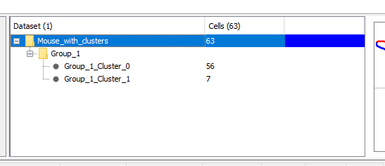
```

It lists the name of the dataset, the number of cells it contains, and the colour the dataset is represented by in charts. The numbers in brackets in the table header shows the total selected number of datasets and cells.

Two types of dataset can be represented: root datasets and child datasets. A root dataset is the top-level dataset in the tree; it is not a child of any other dataset. Child datasets have a parent dataset; either a root dataset, or another child dataset. 

### Selecting datasets

Datasets can be selected by:

- clicking and dragging the mouse to select a block of datasets
- holding down `Shift` and clicking the start and end row of a block of datasets
- holding down `Ctrl` and clicking individual datasets in the order you want them displayed

### Renaming and recolouring datasets

The name of the dataset can be changed by double clicking the dataset name. If a proposed name exists in the panel already, the software will prompt you to choose a different name.

The colour of the dataset for can be set by double clicking the colour box. By default, a colour is selected based on the position of the dataset in the list of all selected datasets: the first is blue, the second yellow, the third green _etc_. The default colour palette is set via `View > Colour palette`. The default colour is overridden if a colour has been explicitly set. The colour will be saved with the dataset.

```{r, out.width="100%", out.height="100%", fig.align='center', echo=F}
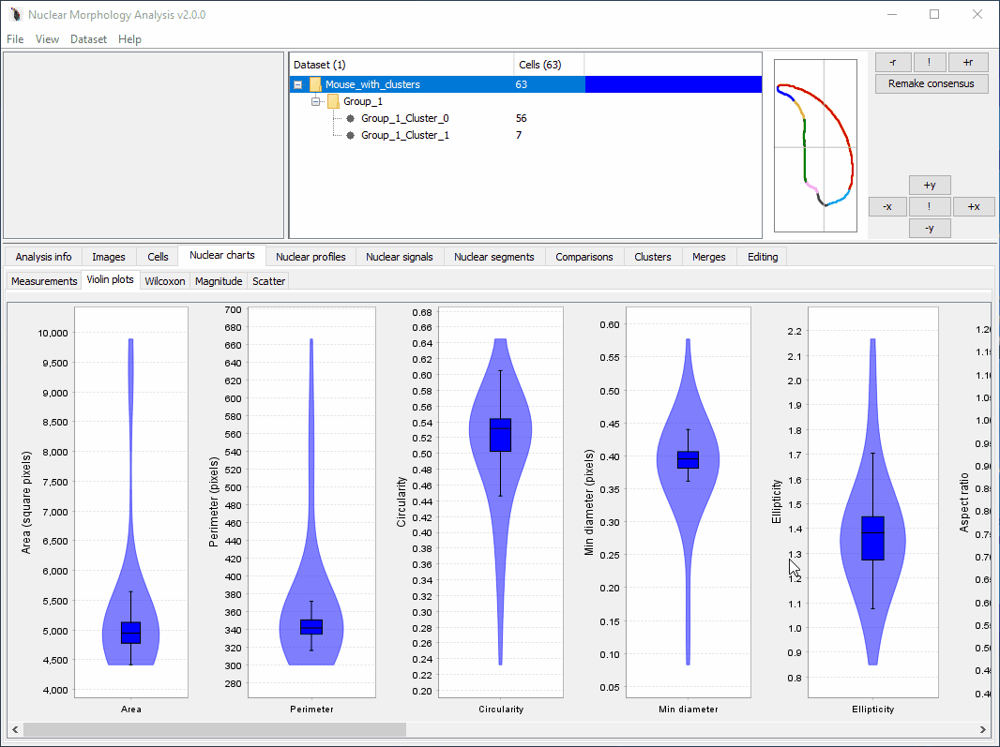
```


## Consensus panel {#consensus-panel}

The consensus panel displays available consensus nuclei for selected datasets. The chart will keep a fixed square aspect ratio. The height of the chart can be adjusted by dragging the slider between the top half of the window (log panel, populations panel, consensus panel) and the bottom half (tab panel); the chart will expand to fit.

The consensus nucleus is generated by sampling the coordinates of each vertically-oriented nucleus at equivalent proportions around the perimeter, and taking the median of the X and Y values at each point to be the consensus value at that point.

```{r, out.width="50%", out.height="50%", fig.align='center', echo=F}
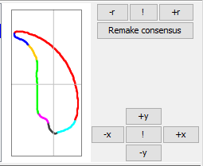
```

If a single dataset is selected, the display shows the segmented outline of the nucleus. If multiple datasets are selected, the outline and fill is shown in the dataset's preferred colour:

```{r, out.width="100%", out.height="100%", fig.align='center', echo=F}
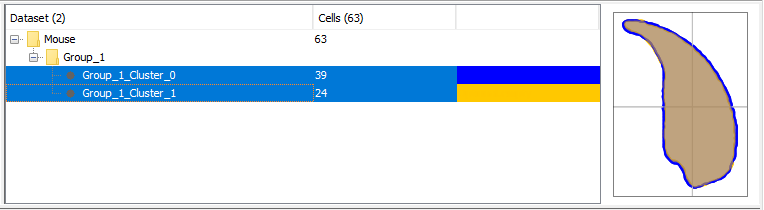
```

### Adjusting the consensus nucleus {#consensus-adjust}

When a single dataset is selected, options are available to adjust the rotation and position of the consensus nucleus. In the figure above, the controls are shown on the right of the consensus panel.

Control|Action
-------|-------
```+r, -r``` | rotate 1 degree clockwise or anti-clockwise about the centre of mass
```!``` | reset the rotation to use the landmarks in the ruleset for orientation
```+x, -x, +y, -y``` | adjust the position of the nucleus by one pixel in the given direction
```!``` | reset the centre of mass to position 0,0.

Rotation and offsets can also be applied in exact amounts using the options at the bottom of the right-click menu on the consensus chart: `Rotate by..` and `Offset...`

## Analysis info tab {#analysis-info-tab}

This contains the analysis parameters used to detect nuclei. If multiple datasets are selected, the background to each row will be green if all datasets have the same value, otherwise, the row will be white.

```{r, out.width="100%", out.height="100%", fig.show='hold', echo=F}
knitr::include_graphics("img/Analysis info.png")
```

## Images tab {#images-tab}

Shows the images in which nuclei have been detected. The detected nuclei are highlighted with a yellow outline.

If image files have been moved, you can relocate them by double clicking the image folder and choosing the updated folder location.

```{r, out.width="100%", out.height="100%", fig.show='hold', echo=F}
knitr::include_graphics("img/Images.png")
```

## Cells tab {#cells-tab}

This displays information on individual cells within a dataset. On the left is a list of all cells within the population. 

The image channels with detected features (nucleus, FISH signals) can be switched between using the box on the lower left, under the cell list.

When a cell is selected, the source image will be displayed, with annotations for the centre of mass, segments, landmarks, and any FISH signals.

The orientation of the nuclei can be toggled using the `Orient` checkbox between actual (the same orientation as in the original image), and oriented (aligned according to the dataset rulesets).

Here is the outline displaying the image with the nucleus:

```{r, out.width="48%", out.height="48%", fig.show='hold', echo=F}
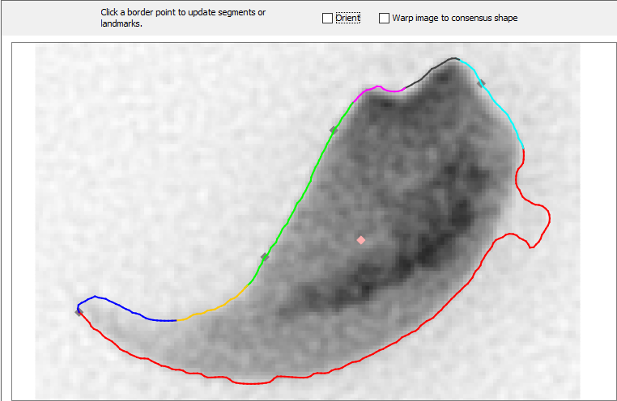
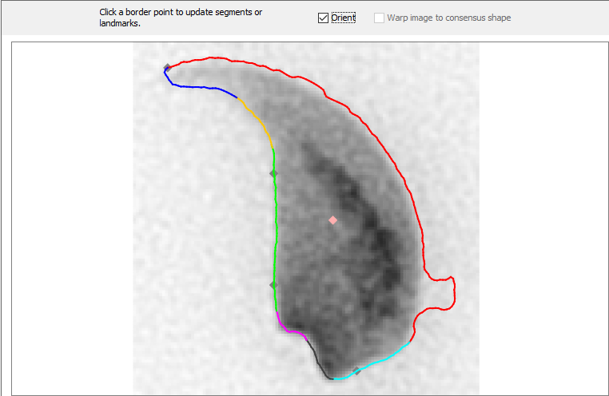
```

The centre of mass is a pink diamond.
The landmarks are grey diamonds on the nuclear outline. Hover the mouse over them to see their names.

Segment boundaries and landmark positions can be updated. When you hover the mouse over the outline, a blue dot will be displayed. Click at any point to set it as a landmark or segment start location:

```{r, out.width="100%", out.height="100%", fig.show='hold', echo=F}
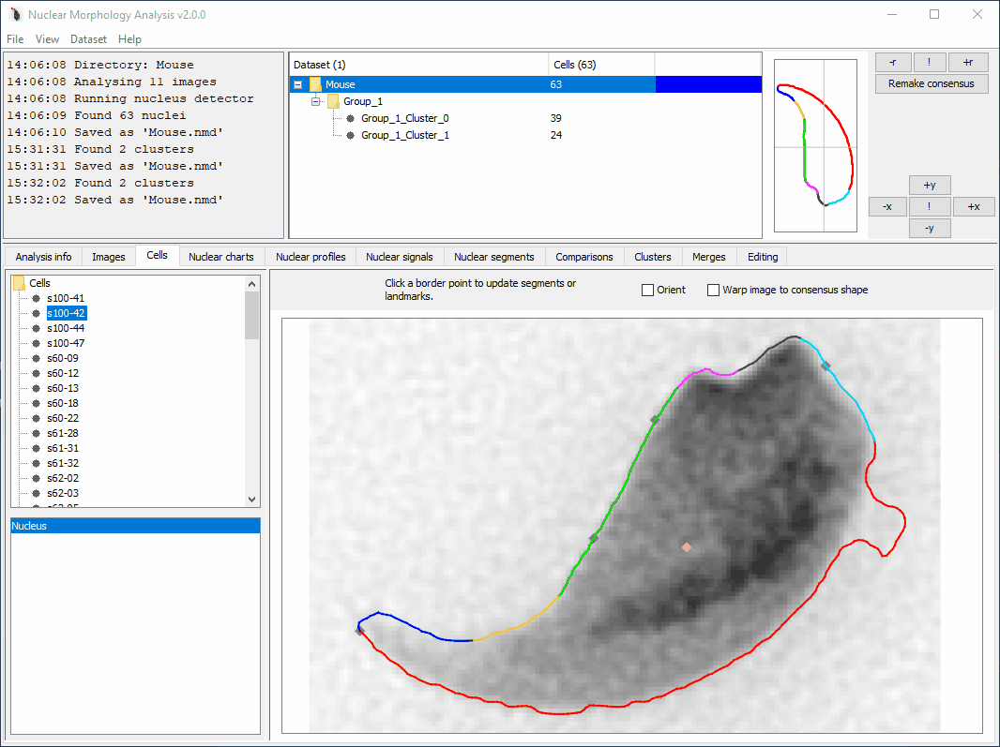
```

This is a dataset with a FISH signal, showing the nucleus and signal channels. The outline and centre of mass of the FISH signal is shown in red:

```{r, out.width="48%", out.height="48%", fig.show='hold', echo=F}
knitr::include_graphics("img/Cell_panel_FISH_nucleus.png")
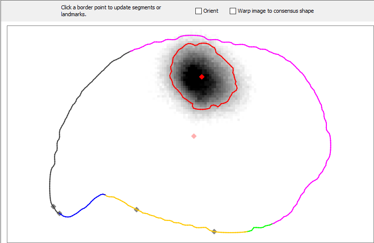
```

## Nuclear charts tab {#nuclear-charts-tab}

Displays measurements of nuclei within and between selected datasets.

### Measurements tab

Mean, median, standard error of the mean, coefficient of variation and 95% confidence intervals for nuclear measurements. 

```{r, out.width="100%", out.height="100%", fig.show='hold', fig.align='center', echo=F}
knitr::include_graphics("img/Nuclear charts_Measurements.png")
```

### Violin plots tab

This tab shows information on [nuclear measurements](#measurements) for selected datasets in a series of violin and boxplots. The colour of each series in the boxplot reflects the dataset colour in the [populations panel](#populations-panel). To change colours, double click the dataset colour in the populations panel. 

```{r, out.width="100%", out.height="100%", fig.show='hold', fig.align='center', echo=F}
knitr::include_graphics("img/Nuclear charts_Violin plots.png")
```

### Wilcoxon tab

This tab shows the results of pairwise Wilcoxon rank sum tests (a.k.a. Mann-Whitney U-tests) of population medians for each of the nuclear parameters, with Bonferroni correction for multiple testing. P-values significant at the 5% and 1% are highlighted in yellow and green respectively.

The U statistic is given above the diagonal, and the p-value below the diagonal.

```{r, out.width="100%", out.height="100%", fig.show='hold', fig.align='center', echo=F}
knitr::include_graphics("img/Nuclear charts_Wilcoxon.png")
```

### Magnitude tab

This shows the pairwise magnitude differences between datasets, to give a feel for the biological significance of any differences detected between samples. The value in each cell of the table for each measurement is the median value of the measurement in the dataset of the row, divided by the median value of the measurement in the dataset of the column.

```{r, out.width="100%", out.height="100%", fig.show='hold', fig.align='center', echo=F}
knitr::include_graphics("img/Nuclear charts_Magnitude.png")
```

### Scatter tab

Allows comparisons between two parameters, via the drop down lists. The Spearman's rank correlation coefficient for each selected dataset is given in the table to the left. The nuclei can be [filtered](#filtering-cells-method) using the 'Filter visible' button.

```{r, out.width="100%", out.height="100%", fig.show='hold', fig.align='center', echo=F}
knitr::include_graphics("img/Nuclear charts_Scatter.png")
```

## Nuclear profiles tab {#nuclear-profiles-tab}

The profiles tab displays the morphological profiles calculated for datasets. 

At the top of each chart are display options:

- `Normalised`: when ticked, all profiles are stretched to the same length. When unticked, nucleus profiles are shown at their actual length, corresponding to the perimeter length of the nucleus (the median profile length is set to the median of the lengths of the nuclei in the dataset)
 - `Left`: if the displayed dataset(s) are not normalised, they are aligned to the left edge of the chart
- `Right`: if the displayed dataset(s) are not normalised, they are aligned to the right edge of the chart
- `Show annotations`: if selected, show segment and landmark names (only applies when a single dataset is selected)
- `Show nuclear profiles`: if selected, show individual nucleus profiles (only applies when a single dataset is selected)

If a single dataset is selected in the [populations panel](#populations-panel), the profile tab displays the profiles for all nuclei in the dataset in light grey, the segmented median profile in the chosen palette colours, and the interquartile range about the median in dark grey.

If multiple datasets are  selected in the populations panel, the profile tab displays the median profile in the chosen dataset colour, and the interquartile range about the median in alighter shade of the dataset colour. 

It contains the following tabs:

### Angle profile

Calculated by measuring the angle between the three border points from the point `window size` pixels behind to this point, to the point `window size` pixels ahead of this point.

```{r, out.width="100%", out.height="100%", fig.show='hold', fig.align='center', echo=F}
knitr::include_graphics("img/Nuclear profiles_Angle profile.png")
```

### Diameter profile

The distance from each border point, through the centre of mass of the nucleus, to the opposite border. Expressed as a fraction of the maximum diameter per nucleus.

```{r, out.width="100%", out.height="100%", fig.show='hold', fig.align='center', echo=F}
knitr::include_graphics("img/Nuclear profiles_Diameter profile.png")
```

### Radius profile
 
The distance of each border point from the centre of mass. Expressed as a fraction of the maximum radius per nucleus.

```{r, out.width="100%", out.height="100%", fig.show='hold', fig.align='center', echo=F}
knitr::include_graphics("img/Nuclear profiles_Radius profile.png")
```

### Variability

The variability plot shows the size of the interquartile range along the median profile, and therefore shows the regions of the profile that are most variable within the dataset. The drop-down list at the top allows the variabilty of each profile type to be selected.

```{r, out.width="100%", out.height="100%", fig.show='hold', fig.align='center', echo=F}
knitr::include_graphics("img/Nuclear profiles_Variability.png")
```

## Nuclear signals tab {#nuclear-signals-tab}

This tab displays information relating to FISH signals.

### Overview {#nuclear-signals-overview-tab}

This shows a table with average information about each signal group that has been detected, and a chart with the outline of the consensus nucleus (if refolded) and approximate positions of each signal.

The signals from each nucleus are drawn as a dot at the centre of mass of each signal. Tick the 'Show signal radii' option to draw a translucent circle on each signal with an equal area to the measured signal. Hover the mouse over a signal to show the nucleus image from which it was detected.

Note - a more accurate mapping of signals onto the consensus can be achieved using signal warping.

Signal groups within a dataset can be merged together using the 'Merge signal groups' button. Merged signal groups do not affect the original signal groups - they duplicate the original signals and add them to a new group.

```{r, out.width="100%", out.height="100%", fig.show='hold', fig.align='center', echo=F}
knitr::include_graphics("img/Nuclear signals_Overview.png")
```

### Detection settings {#nuclear-signals-detection-tab}

This shows the settings that were used to detect each signal group in the dataset. Double click the signal group colour to change the colour.

```{r, out.width="100%", out.height="100%", fig.show='hold', fig.align='center', echo=F}
knitr::include_graphics("img/Nuclear signals_Detection settings.png")
```

### Signal counts {#nuclear-signals-counts-tab}

Displays the number of signals detected per nucleus. Datasets can be filtered to select nuclei with a given number of signals using the 'Filter nuclei' button.

```{r, out.width="100%", out.height="100%", fig.show='hold', fig.align='center', echo=F}
knitr::include_graphics("img/Nuclear signals_Signal counts.png")
```

### Violin plots {#nuclear-signals-violin-tab}

This shows violin and boxplots for each of the [signal measurements](#signal-measurements).

```{r, out.width="100%", out.height="100%", fig.show='hold', fig.align='center', echo=F}
knitr::include_graphics("img/Nuclear signals_Violin plots.png")
```

### Scatter  {#nuclear-signals-scatter-tab}

This allows scatter plot comparisons between signal measurements, with Spearman's rank correlation coefficients shown at the left. As with all scatter panels, the datasets can be filtered on visible values using the 'Filter visible' button.

```{r, out.width="100%", out.height="100%", fig.show='hold', fig.align='center', echo=F}
knitr::include_graphics("img/Nuclear signals_Scatter.png")
```

### Shells  {#nuclear-signals-shells-tab}

Displays the resuls of shell analysis. Shell analysis can be run via 'Dataset' > 'Add' > 'Shell analysis of signals'. 

If the selected datasets contain a single signal group, the chart will display a bar chart of the percentge signal detected in each shell. If multiple signal groups with shell results are present, the chart will instead show a heat map, in which the intensity of each square corresponds to the percentage signal in each shell. You can think of it as looking at the bar charts from above.

The upper table shows whether the shell results are significantly different to a random distribution via a chi square test.

The lower table shows pairwise comparisons between any shell results in the selected datasets, again by chi square. The pairwise tests require the shell results to have the same number of shells. 

```{r, out.width="100%", out.height="100%", fig.show='hold', fig.align='center', echo=F}
knitr::include_graphics("img/Nuclear signals_Shells.png")
```

### Colocalisation  {#nuclear-signals-colocalisation-tab}

Only active if there is more than one signal group present in a dataset. This shows the distances between closest signal pairs. For each signal group within a dataset, signal pairs are calculated using the following method:

- Signals within a nucleus are identified
- The distances between all signals of different groups is calculated as the distance between the centres of mass.
- The pair with the shortest distance is recorded and removed.
- The process repeats with the remaining signals
-  Any remaining unpaired signals are ignored and the paired distances are reported.

```{r, out.width="100%", out.height="100%", fig.show='hold', fig.align='center', echo=F}
knitr::include_graphics("img/Nuclear signals_Colocalisation.png")
```

### Warping  {#nuclear-signals-warping-tab}

Displays the results of [signal warping](#warp-signals-method). The table on the left shows all warped images in the selected datasets, and their options. Click a warped signal to display it in the chart on the right. Select multiple warped signals to create an overlay.

The 'Pseudocolour signals' checkbox allows you to toggle between greyscale signals and the pseudocolour shown in the table. Double click the colour box to change the pseudocolour. Note that this is distinct from the signal group colours in the 'Nuclear signals tab' - you can have the same signal group warped with different options in different colours.

The slider allows thresholding of the warped signal.

The 'Export image' button allows you to save the warped image to a file.

The 'Full MS-SSIM*' button opens a comparator showing the full structural similarity scores between any compatible warped signals in any datasets currently open.

```{r, out.width="100%", out.height="100%", fig.show='hold', fig.align='center', echo=F}
knitr::include_graphics("img/Nuclear signals_Warping.png")
```

## Nuclear segments tab {#nuclear-segments-tab}

The segments tab displays information on the segments within the median profile of the selected dataset(s).


### Violin plots tab

The violin plots tab shows the range of segment lengths in the desired scale for all selected populations. If multiple datasets are selected, they must have the same number of segments for a meaningful comparison to be made.

```{r, out.width="100%", out.height="100%", fig.show='hold', fig.align='center', echo=F}
knitr::include_graphics("img/Nuclear segments_Violin plots.png")
```

### Wilcoxon tab

The Wilcoxon tab shows the Wilcoxon rank-sum tests for pairwise comparisons between datasets for each segment.

```{r, out.width="100%", out.height="100%", fig.show='hold', fig.align='center', echo=F}
knitr::include_graphics("img/Nuclear segments_Wilcoxon.png")
```

### Magnitude tab

The Magnitude tab shows the the pairwise magnitude differences between datasets for each segment.

```{r, out.width="100%", out.height="100%", fig.show='hold', fig.align='center', echo=F}
knitr::include_graphics("img/Nuclear segments_Magnitude.png")
```

## Comparisons tab {#comparisons-tab}

The Venn tab compares overlaps in nuclei between datasets, presented as a table.It is primarily designed to allow comparison of different child datasets after filtering or clustering.

```{r, out.width="100%", out.height="100%", fig.show='hold', fig.align='center', echo=F}
knitr::include_graphics("img/Comparisons_Venn.png")
```

Detailed Venn presents the Venn data in a pairwise format, with more detailed breakdown of the numbers of shared and unshared nuclei.

```{r, out.width="100%", out.height="100%", fig.show='hold', fig.align='center', echo=F}
knitr::include_graphics("img/Comparisons_Detailed Venn.png")
```

## Clusters tab {#clusters-tab}

The clusters panel shows information on [clustering](#clustering-method) analyses that have been run previously. When cluster groups are available, the analysis parameters for the groups are shown in the table.

```{r, out.width="100%", out.height="100%", fig.show='hold', echo=F}
knitr::include_graphics("img/Clusters.png")
```

## Merges tab {#merges-tab}

If a selected dataset is a merge of other datasets, this panel displays the analysis parameters of the source datasets. As with the main analysis info tab, matching values are highlighted in green for each row. It also allows you to extract the source datasets back out of the merge. See also [merge instructions](#merge-method).

```{r, out.width="100%", out.height="100%", fig.show='hold', echo=F}
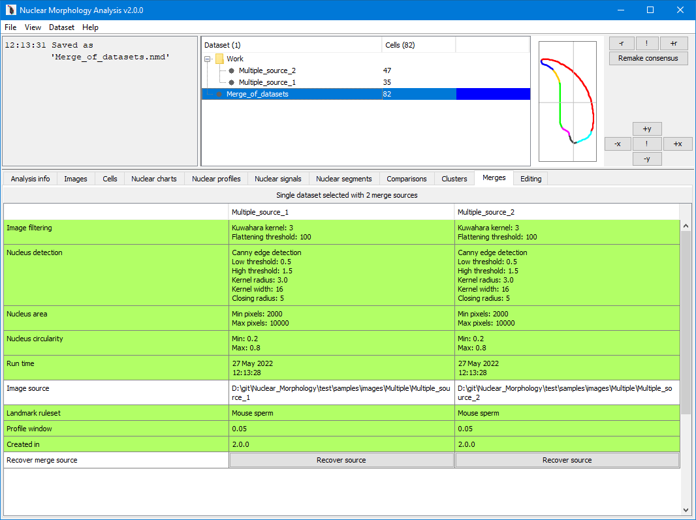
```

## Editing tab {#editing-tab}

This allows segments and landmarks to be updated within root datasets. The consensus nucleus for the selected dataset is displayed, with annotations for the landmarks. The landmarks are grey diamonds on the nuclear outline. Hover the mouse over them to see their names.

Segment boundaries and landmark positions can be updated. When you hover the mouse over the outline, a blue dot will be displayed. Click at any point to set it as a landmark or segment start location. All cells will be updated to their best fit to the new location:

```{r, out.width="100%", out.height="100%", fig.show='hold', echo=F}
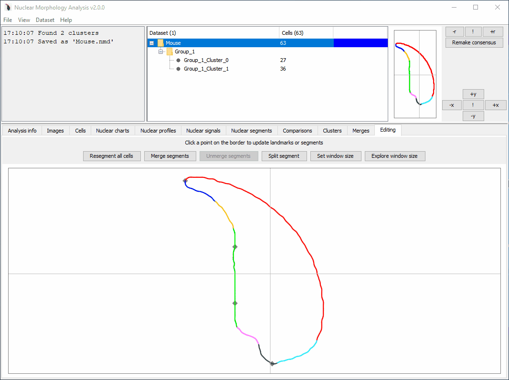
```

If you want to merge or split segments, use the buttons at the top of the panel. Merged segments can be unmerged; the unmerge button will be greyed out unless there are merged segments available.

### Angle window size explorer

If you want to see the effect of changing angle window sizes, click `Explore window size`. This will open a new window that allows the effects of altering the angle profile window size to be simulated across a range of values. No changes will be made to your actual dataset.

Enter the smallest angle window size to test (`0-1`), the largest to test (`0-1`), and the step size between them, then click run. The angle profiles generated for each of the window sizes will be displayed on the chart. The profile colours form a gradient from blue (lowest window size) to red (highest window size):

```{r, out.width="100%", out.height="100%", fig.show='hold', echo=F}
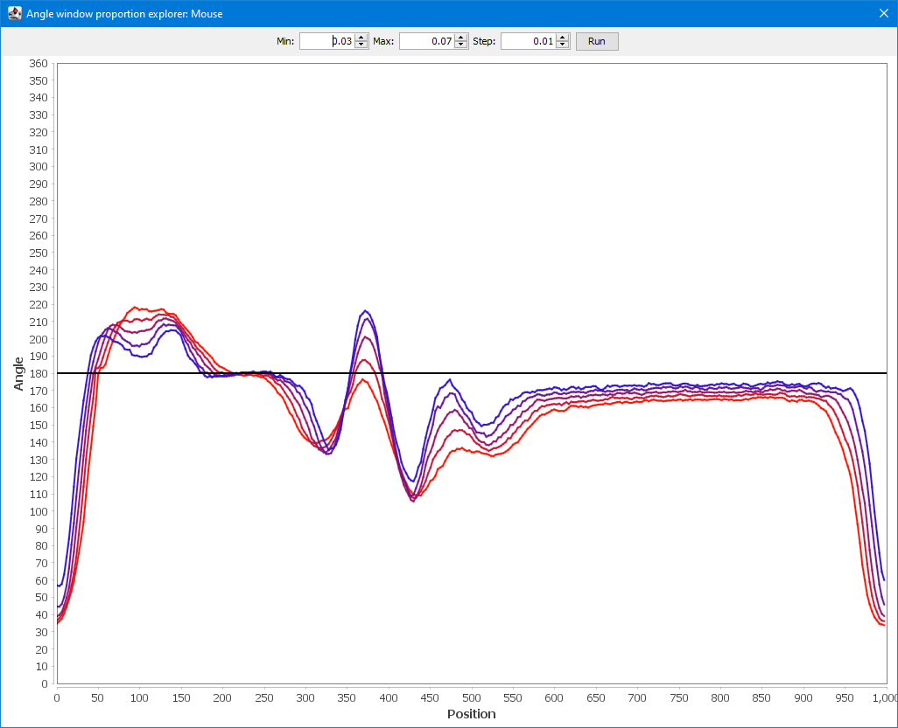
```

If you want to change the window size in your actual dataset, click the `Set window size` button.
