--- 
title: "Nuclear Morphology Analysis User Guide"
author: "Ben Skinner"
date: "`r Sys.Date()`"
site: bookdown::bookdown_site
output: 
  bookdown::gitbook:
    css: style.css
    config:
      search:
        engine: lunr
      sharing:
        facebook: false
        twitter: false
        all: false
    split_by: section
  bookdown::markdown_document2:
    base_format: rmarkdown::md_document
    variant: gfm
documentclass: book
bibliography: [book.bib, packages.bib]
biblio-style: apalike
link-citations: yes
description: "User guide for Nuclear Morphology Analysis"
---

# Introduction

This is the help and documentation for Nuclear Morphology Analysis version ${project.version}, scientific image analysis software for studying nuclear morphology and nuclear organisation in cells with asymmetric nuclei.

```{r include=FALSE}
# automatically create a bib database for R packages
knitr::write_bib(c(
  .packages(), 'bookdown', 'knitr', 'rmarkdown', 'tidyverse'
), 'packages.bib')
```


This section covers the basic principle of the analyses, and what we can measure.

## Angle profiling

The method for morphological analysis, described in [our paper](https://academic.oup.com/biolreprod/advance-article/doi/10.1093/biolre/ioz013/5315749)), allows us to automatically identify nuclei in microscopy images, and then find key landmarks for orientation and measurement. This is performed by generating an _angle profile_, that describes the shape of the nucleus by measuring internal angles around its perimeter:

```{r, out.width="50%", out.height="50%", echo=F, fig.align='center'}
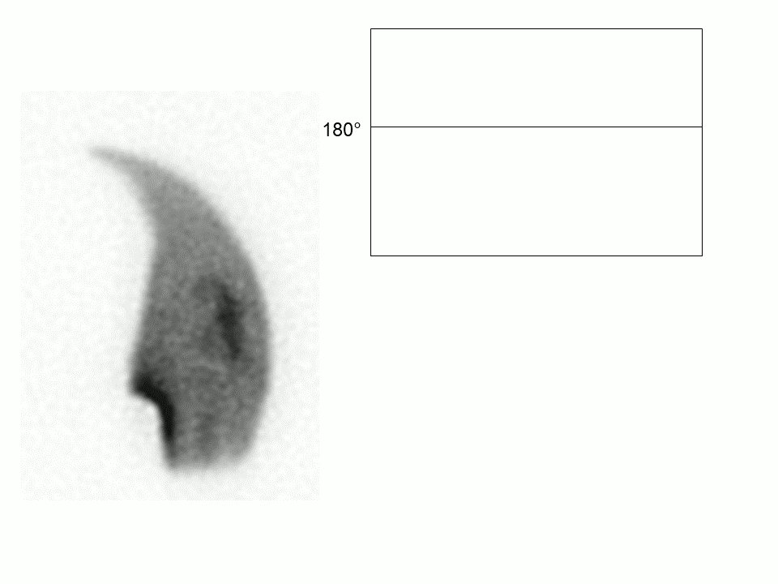
```

No matter the orientation of the nucleus in the image, we can see features such as the hook and the tail attachment point show up show up in the profile:

```{r, out.width="90%", out.height="90%", echo=F, fig.align='center'}
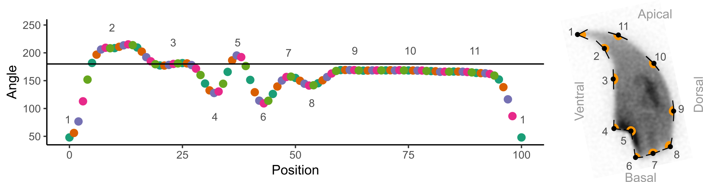
```

Local minima and maxima define corners in the nuclear outline, and allow the key landmarks of interest to be found no matter the orientation of the nucleus. These profiles can then be aligned against each other. Here, we have angle profiles from ~400 mosue sperm nuclei aligned against each other, shown in grey, with the median of these values in the black line.

```{r, echo=F, message=F, warning=F, fig.height=3}
library(tidyverse)

parent.data <- readr::read_tsv("img/C57_CBA_stats.tsv") 

multi.profile.data <- parent.data %>%
  dplyr::filter(Dataset == "C57 3") %>%
  dplyr::select(CellID, starts_with("Angle_profile")) %>%
  tidyr::pivot_longer(-CellID, names_to="Profile_position") %>%
  dplyr::group_by(Profile_position) %>%
  dplyr::mutate(Position = as.numeric(gsub("Angle_profile_", "", Profile_position)),
                Median = median(value),
                Q25 = quantile(value, 0.25),
                Q75 = quantile(value, 0.75)) %>%
  dplyr::ungroup()

ggplot(multi.profile.data, aes(x=Position, y=value, group=CellID))+
  geom_hline(yintercept = 180)+
  geom_line(col="darkgrey")+
  geom_line(aes(y=Median), size=1.2)+
  labs(y="Angle")+
  theme_classic()
```

The median profile lets us get a good idea of the overall shape of the nuclei in a sample. We also get some idea of the variation in a population of sperm. If most nucleus profiles are very similar, there is little variation in shapes. If most nucleus profiles are very different to each other, there is a lot of variation in shapes. This can be visualised more easily by drawing the interquartile range of the angles, instead of every profile:

```{r, echo=F, message=F, warning=F, fig.height=3}
library(tidyverse)

ggplot(multi.profile.data, aes(x=Position))+
  geom_hline(yintercept=180)+ # The 180 degree line
  geom_ribbon(aes(ymin = Q25, ymax = Q75), alpha = 0.5)+ # the interquartile range; alpha is transparency
  geom_line(aes(y=Median), size=1.2)+ # the median line
  labs(x="Position", y="Angle")+
  coord_cartesian(ylim = c(50, 250))+
  theme_classic()
```

## What we measure in nuclei {#measurements}

In addition to the shape profiles, these values are automatically calculated for nuclei and displayed in the [Nuclear charts tab](#nuclear-charts-tab).

Measurement | Dimension | Formula | Description
----------|------|------|------------
Area | Area | | the two dimensional area of the nucleus
Perimeter | Length | | the length of the nuclear perimeter
Max feret | Length | | the maximum caliper diameter across the nucleus
Min diameter | Length | | the shortest diameter through the centre of mass of the nucleus
Variability | Angle | | the square root of the sum-of-squares difference at each index between between the nuclear profile and the dataset median profile, normalised to the length of the median profile.
Ellipticity | None | `H/W` | the height divided by width of the nuclear bounding box in the vertically oriented nucleus
Aspect ratio | None | `W/H` | the inverse of ellipticity
Elongation | None | (`H-W`)/(`H+W`) | the bounding height minus the bounding width, divided by the bounding height plus the bounding width
Regularity | None | (`pi*H*W`)/(`4*area`) | A measure of how regular the shape is; does it have rotational symmetry
Circularity | None | ```(4*pi*area)/(perimeter^2)``` | the closeness of the nucleus to a circle, between 0 and 1, where 1 is a perfect circle.
Bounding width | Length | | the width of the bounding rectangle of the nucleus, after rotation to vertical
Bounding height | Length | | the height of the bounding rectangle of the nucleus, after rotation to vertical
Length of hook [rodent sperm only] | Length | | the distance from the vertical region defined by the top and bottom vertical points to the lower x-edge of the bounding rectangle of the vertically oriented nucleus
Width of body [rodent sperm only] | Length | | the distance from the vertical region defined by the top and bottom vertical points to the upper x-edge of the bounding rectangle of the vertically oriented nucleus

```{r, out.width="100%", out.height="100%", fig.show='hold', echo=F}
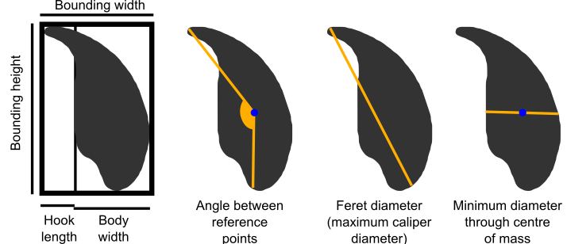
```

## What we measure in FISH signals {#signal-measurements}

These values are automatically calculated for FISH signals and displayed in the [Nuclear signals tabs](#nuclear-signals-tab)

Statistic | Dimension | Description
----------|------|------------
Area | Area | the area of the signal
Perimeter | Length | the length of the nuclear perimeter
Angle | Angle | the angle of the signal from the orientation point
Distance from CoM | Length | the absolute distance of the signal centre of mass from the nucleus centre of mass
Fractional distance from CoM | Fraction | the distance from CoM as a propotion of the total distance from the nucleus CoM through the signal CoM to the nucleus border
Radius | Length | the radius of the circle that has the same area as the signal

<!--chapter:end:index.Rmd-->

# Installation and configuration

This section contains information on installing, removing and customising the program.

## Installing

Nuclear Morphology Analysis is designed to be runnable on Windows, Linux and MacOs.

### Windows

Option | Link | Info
-------|------|------
Portable | [Nuclear_Morphology_Analysis_${project_version}.zip](https://bitbucket.org/bmskinner/nuclear_morphology/downloads/Nuclear_Morphology_Analysis_${project_version}.zip) | Software and Java runtime in a portable format. Unzip the folder wherever you like and run 'Nuclear_Morphology_Analysis.exe'. To remove, just delete the folder.
Installer | [Nuclear_Morphology_Analysis_${project_version}.msi](https://bitbucket.org/bmskinner/nuclear_morphology/downloads/Nuclear_Morphology_Analysis_${project_version}.msi) | Software and Java runtime in an installer for Windows. This will add the software to your installed programs, and create a start menu entry. May require administrator privileges depending on where you install to.

### Linux

Software and Java runtime in a portable format built in Debian 10.
 
Option | Link | Info
-------|------|------
Linux portable | link | Software and Java runtime in a portable format. Unzip the folder wherever you like and run 'Nuclear_Morphology_Analysis.sh'.

### MacOS

The software is not available packaged with the Java runtime because I don't have a Mac to package and test on.

- Install Java 16 or higher on your Mac
- Download [Nuclear_Morphology_Analysis_${project_version}_standalone.jar](https://bitbucket.org/bmskinner/nuclear_morphology/downloads/Nuclear_Morphology_Analysis_${project_version}_standalone.jar) 

Due to security permissions in recent versions of MacOS (Catalina and above) the program won't have access to user folders if launched by double-clicking the jar file. You should launch from the Terminal; open the Terminal, navigate to the directory containing the jar file, and launch the jar using `java -jar Nuclear_Morphology_Analysis_x.y.z.jar`, changing x, y and z to the appropriate numbers for your version.

## Uninstalling

### Windows installer version

- Go to Programs and Features, find Nuclear Morphology Analysis in the list of installed programs, and click 'Uninstall'
- Nuclear Morphology Analysis also creates a folder in your home directory called `.nma`. Delete this folder too to remove all traces of the program.

### Portable version

- Delete the folder containing the program.
- Nuclear Morphology Analysis also creates a folder in your home directory called `.nma`. Delete this folder too to remove all traces of the program.

## Configuration and user data

Nuclear Morphology Analysis creates a folder in your home directory called `.nma` on first launch, if this folder does not already exist. The folder is used to store:

- log files
- built-in rulesets for shapes we can detect
- custom rulesets for novel shapes you want to analyse
- custom program options

You can open the configuration folder via `Help > Open config directory`.

### Logs

The system state is logged when NMA is started in case debugging is needed. None of the logged data leaves your computer unless you explicitly send it. If you do find a bug or have a problem, you can send the latest log file to me and it may help me track down the problem. There will be up to 5 log files, with `nma.0.log` containing the most recent logs. 

### Rulesets {#config-rulesets}

Rulesets are how we identify landmarks in nuclei. The program has default rulesets for mouse sperm, pig sperm and round nuclei.
These are stored in XML format. If you delete one of the default files, it will be recreated when the program is next launched. 

You can make your own ruleset files and save them in the `rulesets` folder; they will be included in the nucleus detection setup screen when the program is next launched. 

A ruleset needs to describe the landmarks in the nucleus, how we find them, which landmarks we use for orientation of the nucleus, and what measurements we should make. For example, the round nucleus ruleset is the simplest:

```{}
<?xml version="1.0" encoding="UTF-8"?>
<RuleSetCollection name="Round" application="VIA_MEDIAN" version="2.0.0" axis="Y">
  <Orient name="BOTTOM" value="Longest axis" />
  <Orient name="Y" value="Longest axis" />
  <Orient name="REFERENCE" value="Longest axis" />
  <Landmark name="Longest axis">
    <Ruleset type="Diameter profile">
      <Rule type="IS_MAXIMUM">
        <Value>1.0</Value>
      </Rule>
    </Ruleset>
  </Landmark>
  <Measurement>Perimeter</Measurement>
  <Measurement>Elongation</Measurement>
  <Measurement>Area</Measurement>
  <Measurement>Min diameter</Measurement>
  <Measurement>Aspect ratio</Measurement>
  <Measurement>Difference from median</Measurement>
  <Measurement>Bounding width</Measurement>
  <Measurement>Bounding height</Measurement>
  <Measurement>Regularity</Measurement>
  <Measurement>Ellipticity</Measurement>
  <Measurement>Circularity</Measurement>
</RuleSetCollection>
```

It contains one landmark, called `Longest axis`. This is defined as the point with the maximum value in the diameter profile. The landmark is used to specify three orientation marks: `BOTTOM`, `Y`, and `REFERENCE`. The `REFERENCE` point is the point from which profiles start. `BOTTOM` and `Y` indicate points that should be used to orient the nucleus, by rotating the nucleus such that this point is diretly below the centre of mass. 

The `Measurement` values show the standard measures that will be calculated when nuclei are detected; several of these (e.g. aspect ratio) rely on the nucleus being orientatble, which is why it is important to have at least one landmark that can be used for orientation.

### Custom options {#config-file}

Custom options are set in the `config.ini` file in the configuration directory. They are in the format `OPTION=VALUE`. The following options can be set, and will take effect when the program is next launched:

Key        | Allowed Values | Effect
-----------| ---------------|--------------
``DEFAULT_IMAGE_SCALE`` | A positive number e.g. ``18.0`` | Sets the default scale for converting pixels to microns
``DEFAULT_COLOUR_SWATCH`` | ``REGULAR_SWATCH`` ``ACCESSIBLE_SWATCH`` ``NO_SWATCH`` | Sets the default colouring of datasets and segments
``DEFAULT_DIR`` | *directory with backslashes escaped* e.g. `C:\\path\\to\\folder`    | Sets the default folder for exporting data
``DEFAULT_DISPLAY_SCALE`` | ``PIXELS`` ``MICRONS`` | Sets the default scale to display in charts and tables
``REFOLD_OVERRIDE`` |  ``true`` ``false``| If true, the 'best-fit nucleus' method will always be used instead of the position averaging method
``USE_ANTIALIASING`` | ``true`` ``false`` | Sets the default value for the 'Use anti-aliasing' option. False makes charts faster to render, but not as pretty.
``USE_DEBUG_INTERFACE`` | ``true`` ``false`` | If true, shows debugging information in some charts
``USE_GLCM_INTERFACE`` | ``true`` ``false`` | If true, allows GLCM measurements for nuclei
``FILL_CONSENSUS`` | ``true`` ``false`` | Sets the default value for the 'Fill consensus' checkbox in the view menu 

<!--chapter:end:02-install.Rmd-->

# How-to guide

This section describes how to run an analysis, and some of the other common tasks.

## Running a new analysis {#new-analysis}

### Very quick start

- Download and unzip the [folder of test images](https://bitbucket.org/bmskinner/nuclear_morphology/downloads/Testing_mouse_image_set.zip)
- Open the software
- Drag the folder of images onto the software
- Click 'Proceed with detection' to use the default settings (which work fine with these test images)

```{r, out.width="100%", out.height="100%", fig.show='hold', fig.align='center', echo=F}
knitr::include_graphics("img/gifs/New_analysis.gif")
```

### A more detailed start

There are several ways to start new morphology analysis:

- By dragging a folder of images onto the software 

- By selecting 'File > New analysis > Use custom detection options' in the menu; you will be then asked to select a folder of images to be analysed. 

- By selecting 'File > New analysis > Use saved detection options' in the menu; you will be then asked to select a settings file, and a folder of images to be analysed. 

The guide below uses a testing set of images, which you can download as a [zipped folder](https://bitbucket.org/bmskinner/nuclear_morphology/downloads/Testing_mouse_image_set.zip).

When starting an analysis using options (1) or (2), the following setup screen is shown. To help you choose appropriate settings, the images on the right show the pipeline for detecting objects in the first image of the folder selected. Each image enlarges when clicked. If you are happy with the result, select 'Proceed with analysis', otherwise adjust the settings. The images will be updated every time you change a setting. The 'Prev' and 'Next' buttons allow nucleus detection to be run on successive images in the folder(s).

```{r, out.width="100%", out.height="100%", fig.show='hold', fig.align='center', echo=F}
knitr::include_graphics("img/Nucleus_image_prober.png")
```

The settings panel contains the following sections:

### Copying settings

At the top of the window are 'From dataset' and 'From file' buttons. These allow nucleus detection settings to be copied from another source. 

'From dataset' will only be available is an another dataset is open in the software when you are creating the new analysis. Clicking it will provide a list of open datasets, from which you can choose a dataset to copy detection settings from. 

'From file' will open a file chooser so you can select a saved settings file. 

### Image

Set information about the images to be analysed.

Setting | Controls
--------|----------
H&E | Is the image H&E stained, or fluorescence?
Channel | The RGB colour channel containing the nuclei (set to Greyscale if the image is black and white)
Scale | The number of pixels per micron. Allows the real size of images to be entered, so measurements can be presented in microns as well as in pixels. This can be set after an analysis is complete, so don't worry if you don't have this value to hand immediately. If you constantly use the same value (e.g. you only process data from one microscope) you can set is as the default in the configuration file.

### Preprocessing

Set options for removing background.

Setting | Controls
--------|----------
Kuwahara filter | [This smoothing filter](https://en.wikipedia.org/wiki/Kuwahara_filter) is better at preserving edges than the standard Gaussian filter. If enabled, the kernel size must be an odd number
Kuwahara kernel | If enabled, the kernel size must be an odd number
Flatten chromocentres | Bright internal structures can cause the edge detector to pick the wrong feature as the nucleus outline. This option sets any pixels brighter than the threshold value to equal the threshold, thereby removing bright peaks.
Flattening threshold | The value to use for chromocentre flattening

### Object finding

Setting | Controls
--------|----------
Threshold | Uses an absolute signal intensity cutoff to decide what is a nucleus and what is not.
Edge detection | Uses the [Canny edge detection](https://en.wikipedia.org/wiki/Canny_edge_detector) method to find edges in the image. 
Canny low threshold | Suppress weak edge pixels due to noise lower than this value. The default value was empirically chosen to work on mouse sperm images.
Canny high threshold | Suppress weak edge pixels due to noise higher than this value. The default value was empirically chosen to work on mouse sperm images.
Canny kernel radius | The radius for [Gaussian blurring](https://en.wikipedia.org/wiki/Gaussian_blur?searchDepth=1). The radius of the Gaussian convolution kernel used to smooth the source image prior to gradient calculation. The default value is 16.
Canny kernel width | The number of pixels across which the Gaussian kernel is applied. The included implementation will reduce the radius if the contribution of pixel values is deemed negligable, so this is actually a maximum radius. Must be at least 2.
Gap closing radius | The radius of the circle used for [morphological closing](https://en.wikipedia.org/wiki/Closing_%28morphology%29).
Watershed | If your nuclei are close together or partially overlapping, e.g. from cell culture, this will use [watershed segmentation](https://en.wikipedia.org/wiki/Watershed_segmentation) to separate individual cells. Note that this is primarily designed for round nuclei, and the effect on asymmetric nuclei may not be what you want!

### Filtering

Once potential nuclei have been detected by thresholding or edge detection, it must be decided whether they are really nuclei. These settings filter the objects on size and shape.

Setting | Controls
--------|----------
Min and max area | constraints on the size of the detected nuclei. 
Min and max circ | constraint on [circularity](https://en.wikipedia.org/wiki/Roundness_%28object%29). A value of 1 is a perfect circle; a value of zero is entirely non-circular.

### Landmark detection

Setting | Controls
--------|----------
Nucleus type | A dropdown list to select the type of nucleus being analysed. The choice of nucleus type determines the rules that will be used to identify landmarks in the nucleus. The rulesets listed correspond tothe files in the [rulesets folder](#config-rulesets). Custom rule definitions can be added by the user.
Profile window | The window size used to generate morphology profiles. Too low, and you won't detect any features of interest. Too high, and you get enough resolution. The profile window is set as a faction of the perimeter of each nucleus, from zero to one. The default value is 5% of the perimeter, 0.05. The effect of the window size can be seen in the angle window explorer via the [Editing tab](#editing-tab). The angle window can be altered after an analysis has been run.

### Start the analysis

When ready, click the 'Proceed with detection' button in the lower right to be begin finding nuclei. A progress bar in the upper left of the screen (above the log panel) shows the progress through the images in the selected folder. If no nuclei are found in any of the images, no datasets will be returned. If nuclei were detected, they will be analysed, and the new population will appear in the populations panel.

## Curating and filtering nuclei {#curating-filtering-method}

The edge detection and segmentation to find nuclei does not always work perfectly, and so cells can be included in a dataset that have wonky outlines. This can throw off the angle profiling and make datasets look more variable than they truely are. To help avoid this, there are two ways to select only the cells you care about.

### Filtering cells {#filtering-cells-method}

Filtering is a quick way to exclude cells with poor edge detection, or simply to pull out a group of interest to you. Filtering can be performed from the [Nuclear charts scatter tab](#nuclear-charts-tab).

Choose the parameters you want to filter on using the drop-down menus for the X and Y axes of the chart. The defaults are area and difference to the median profile; this usually shows outsized and oddly shaped nuclei quite clearly.

The nuclei can be filtered using the 'Filter visible' button. Zoom to a region on the chart so only a subset of the nuclei are visible, then click the 'Filter visible' button. A new child dataset will be created containing only the nuclei currently visible on the graph.

```{r, out.width="100%", out.height="100%", fig.show='hold', fig.align='center', echo=F}
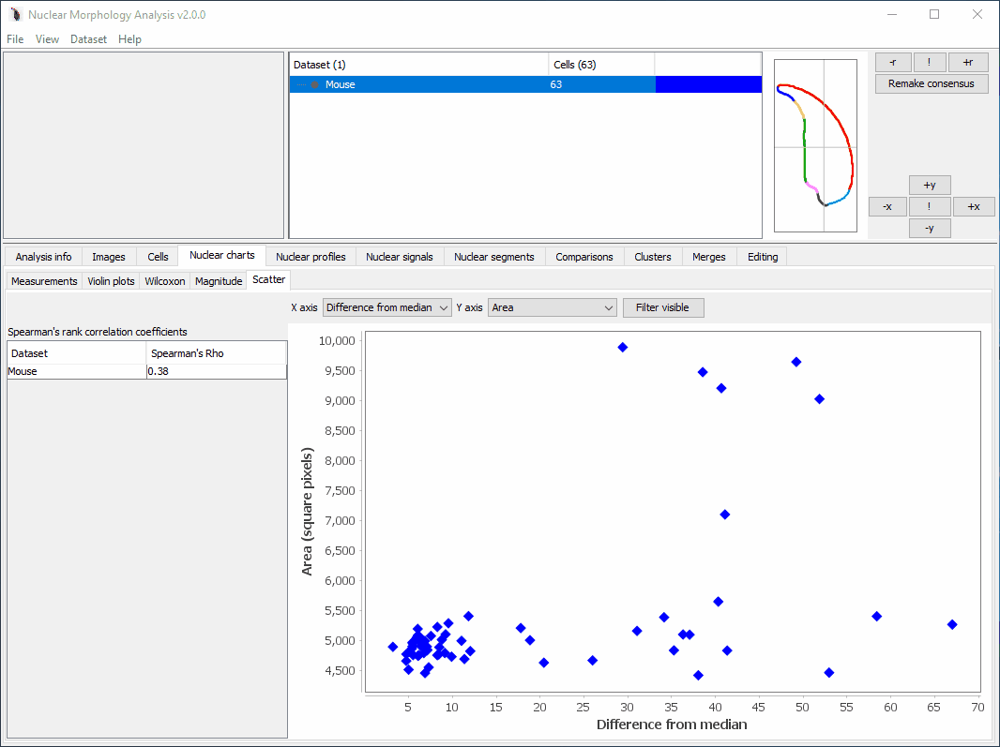
```


### Curating cells {#curating-cells-method}

Manual curation allows you to accept or reject each cell in a dataset. Acceptable cells are copied to a new dataset and reanalysed. The old dataset is not affected. Select a dataset, then choose `Dataset > Curate`. A window will be displayed showing all the nuclei in the dataset oriented.

In the example below, the first four cells in the dataset (`s100.tiff-35` to `s100.tiff-38`) have errors. One is two nuclei overlapping, and the other three have errors in the edge detection. We want to remove these cells from our curated dataset.

```{r, out.width="100%", out.height="100%", fig.show='hold', fig.align='center', echo=F}
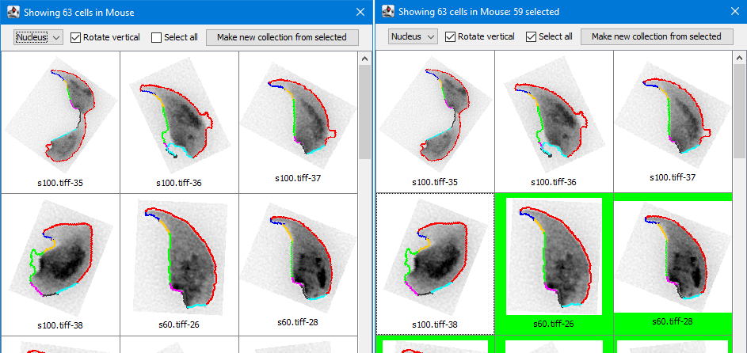
```

Select the nuclei to keep; the table background will turn green for selected nuclei. Use the 'Select all' option as a shortcut if you only need to skip a few nuclei, as in the right image above. You can also deselect the 'Rotate vertical' option to show the nuclei as they appear in their source image.. 

Once you are happy with your selection, click the  `Make new collection from selected` button at the top of the window, and the chosen cells will be added to a new dataset.

For large datasets, it may take some time to load the image for all the nuclei. The loading progress is shown by a loading bar at the bottom of the window.

## Modifying landmarks and segments  {#updating-landmarks-method}

Landmarks and segments can be altered for individual cells, and for the dataset as a whole. For individual cells, see the [cells tab](#cells-tab). To edit segments or landmarks across the entire dataset, see the [editing tab](#editing-tab).

## Merging and combining datasets {#merges-boolean-methods}

### Merging two datasets {#merge-method}

To merge datasets, select them in the [populations panel](#populations-panel), and choose `Dataset > Merge'. You will be asked to choose a file to save the new merged dataset. The merge will run, and a new morphological analysis will be carried out on the merged dataset.

When a merged dataset is selected, the [merges tab](#merges-tab) displays the analysis options for each of the merge sources within the dataset.

To recover a source dataset back out of a merged dataset, click the appropriate `Recover source` button, at the bottom of the panel.

### Boolean logical combinations of datasets {#boolean-method}

These are invoked via `Datasets > Boolean`. They allow a boolean algebraic operation on the cells between two datasets. A new dataset is created containing the cells that meet the criterion. The most common use case is to allow subsetting of datasets using different filtering, clustering or signal child datasets to get a specific combination of cells.

The available options are:

Operation | Condition
-------|-------
```AND``` | the cell is present in both datasets
```OR``` | the cell is present in either dataset (same as [merging datasets](#merge-method))
```NOT``` | the cell is in dataset one, but not dataset two
```XOR``` | the cell is in either dataset one or dataset two, but not both


## Clustering nuclei {#clustering-method}

We often want to explore the variation in nuclei within a dataset; perhaps there are two or more distinct groups of shapes to find. To do this, we can perform clustering, based on the profiles or other measured values.

Clustering is visualised through the [Clusters tab](#clusters-tab). There are three ways to generate clusters:

- Manually
- Automatically, using a clustering algorithm
- Importing a file containing clusters 

### Manual clustering

Allows nuclei to be manually assigned to clusters. 

- Select `Datasets > Add > Clustering manually`. 
- Choose the number of clusters you want to make, and their names
- Each nucleus will be displayed with a button to choose which cluster to put it in

```{r, out.width="100%", out.height="100%", fig.show='hold', echo=F}
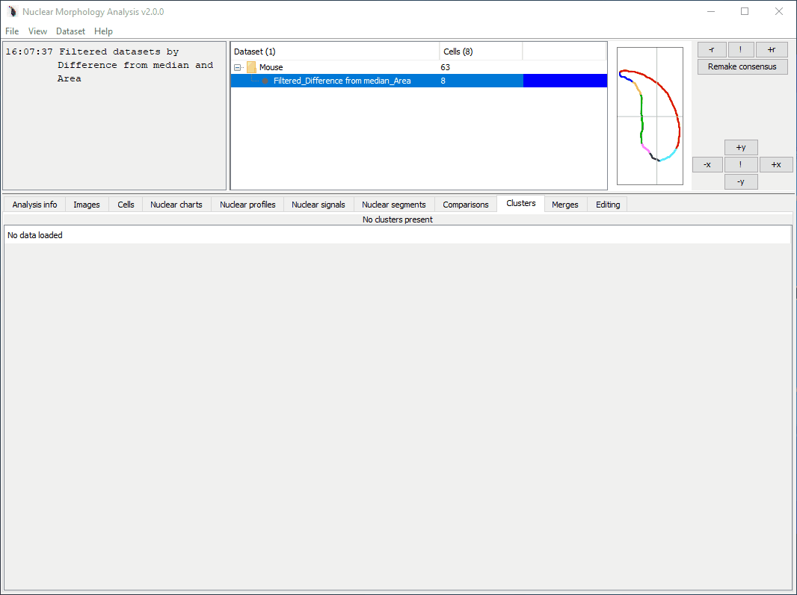
```

### Automatic clustering

Allows nuclei to be assigned to clusters based on their shape, or other measurements. 

- Select `Datasets > Add > Clustering automatically`
- Choose the nuclear parameters to cluster on
- Choose whether to perform dimensionality reduction
- Choose the clustering method

```{r, out.width="100%", out.height="100%", fig.show='hold', echo=F}
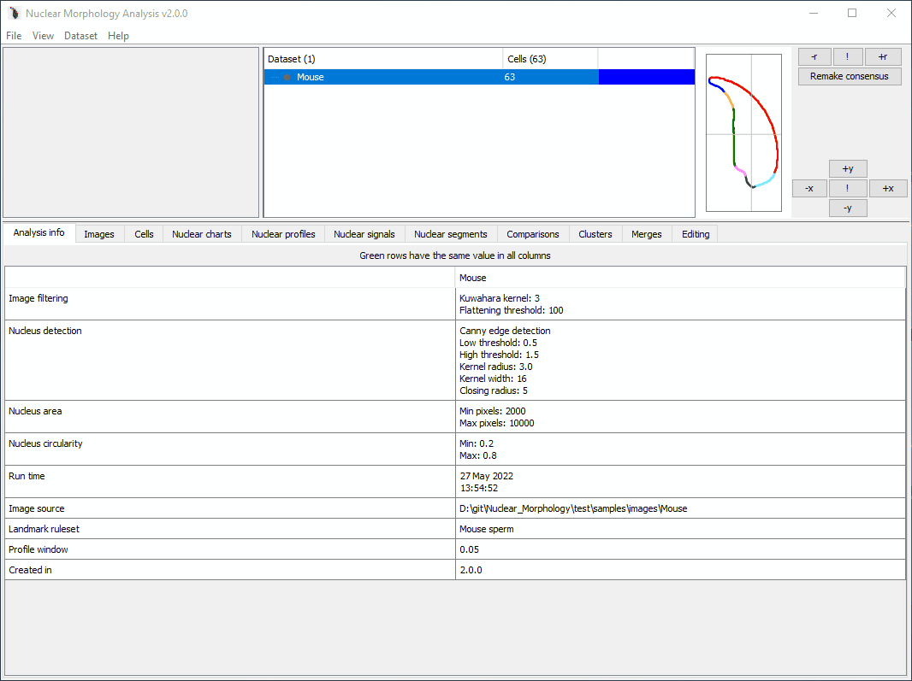
```

The default clustering is on the profile angles within each nucleus. Checkboxes allow selection of other nuclear parameters.

#### Dimensionality reduction

Dimensionality reduction can be optionally applied before clustering. PCA and tSNE are provided; however, for reproducibile analysis it is recommended that you export the measurements and run these in your preferred stats package. tSNE especially makes use of a random number generator, and so generates a slightly different plot every time you run it. This can be controlled with fixed seeds in stats programs like R.

If dimensionality reduction was applied, after clustering is complete, the first two dimensions can be viewed in a scatter plot by clicking the `View plot` button in the cluster parameters table.

#### Clustering method

Clustering can be performed using [hierarchical clustering](https://en.wikipedia.org/wiki/Hierarchical_clustering) or [expectation maximisation](https://en.wikipedia.org/wiki/Expectation%E2%80%93maximization_algorithm) clustering.

Once clustering is complete, if hierarchical clustering was selected, a `Show tree` button will be available. Clicking this button will launch the tree viewer.

```{r, out.width="100%", out.height="100%", fig.show='hold', echo=F}
knitr::include_graphics("img/Clusters_tree_view.png")
```

The tree can be highlighted to show cluster memberships. The first dropdown list selects individual clusters to highlight. The second selects cluster groups to highlight. If the dataset has merge sources, these can be applied as a highlight using the "Show merge sources" button.

The [Newick format](https://en.wikipedia.org/wiki/Newick_format) for the cluster tree can be copied using the 'Copy Newick', for use in other tree editing software.

### Importing clusters {#import-cluster-method}

Sometimes you may want to run clustering on exported data, for example in R, and then use NMA to create the average shape of each cluster. To do this, we can import a file that maps each cell to a cluster.

The R code snippet below demonstrates how to export a cluster file from within R:

```{r, eval=F, echo=T}
# This assumes you have created a column "ClusterID" in your data frame
# with the cluster assignments. The ClusterID column should contain
# integers from 1.
  map.data <- sample.data %>% dplyr::select(CellID, ClusterID)

  write.table(map.data, file = "cluster_map.tsv", sep = "\t", row.names = F, col.names = F, quote = F)
```

The mapping file created should be a tab-separated file, containing the cell id, and the cluster number to which the cell is assigned. No column headers are needed. An example is shown below:

```{}
33e148a2-9239-43e4-9116-7fb9cfd3f170	1
3670723b-185f-4b47-95db-4040b0349d3a	1
4cf346dd-77a3-4533-9565-cc43ec5db0bd	1
77709677-65b4-43d6-912c-182858d904db	1
94701494-ebca-491d-b65d-03ab52478be7	2
2ffb047a-c4eb-41a0-96ae-05e388b0bfdc	2
2610caa7-8456-46b6-b26a-6b87f5c42847	2
8683deb7-0c7c-474c-b895-e34a0cd2ef36	2
7eeabe40-c860-4244-9910-23ce7af6e76e	2
```

To add the clusters, select `Datasets > Add > Clustering from file`. Select your mapping file, and the clusters will be applied as a new cluster group.

```{r, out.width="100%", out.height="100%", fig.show='hold', echo=F}
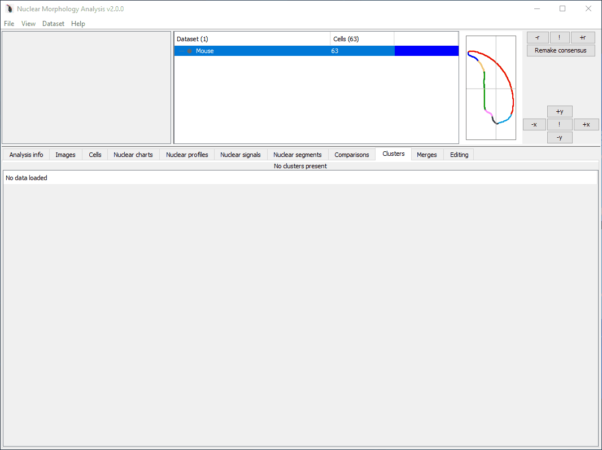
```

## Detecting FISH signals {#detect-signals-method}

Once a dataset has been created (either by a new analysis or loading an existing dataset), we can try to find nuclear signals.

### Very briefly

- Select 'Dataset > Add > Add nuclear signal'
- Choose the folder containing the images with signals
- A detection window will be displayed, similar to the new analysis setup. 
- Outlines of nuclei detected previously will be shown in blue, and detected signals will be outlined in yellow (if they meet filtering criteria) or red (if they fail to meet filtering criteria)
- Once happy with the settings, click 'Proceed with detection'
- Provide a name for the signal group

```{r, out.width="100%", out.height="100%", fig.show='hold', fig.align='center', echo=F}
knitr::include_graphics("img/gifs/Add_signals.gif")
```

### More detail

The images containing FISH signals can be, but do not need to be, the same images containing the nuclei. This means you could have images with (_e.g._) DAPI stained nuclei in the blue channel, and FISH signals in the red or green channels. You could also have one folder of RGB or greyscale images with the DAPI stained nuclei, and another folder of RGB or greyscale images with the FISH signals.

The software determines which nucleus a signal belongs to using the image file name. If you use separate folders of images for nuclei and signals, **the signal images must have the same names as the images from which the nuclei were originally found.**.

For example, here is an analysis with separate folders for each. If a nucleus came from the image named `Image 1.tif`, the signal must also be in an image named `Image 1.tif`:

```{}
Main folder
  |- DAPI folder
  |  |- Image 1.tiff
  |  |- Image 2.tiff
  |- Red signals folder
     |- Image 1.tiff
     |- Image 2.tiff
```

### Image

Set information about the images to be analysed.

Setting | Controls
--------|----------
H&E | Is the image H&E stained, or fluorescence?
Channel | The RGB colour channel containing the signal (set to Greyscale if the image is black and white)
Scale | The number of pixels per micron. Allows the real size of images to be entered, so statistics can be presented in microns as well as in pixels. This can be updated after an analysis is complete. By default, this is copied from the nuclei.

### Thresholding

Setting | Controls
--------|----------
Threshold | The pixels must be equal to or brighter than this to be counted

### Object finding

Setting | Controls
--------|----------
Method | One of the available methods for finding a signal, described below and in the dialog window.
Forward | Takes all objects with pixels over the threshold, meeting the size requirements. If there is a lot of bright background, it can mistake this for signal. 
Reverse | Starts with the brightest pixels (intensity 255), and tries to detect objects meeting size and shape criteria. If it fails, it looks at pixels with intensity 254 or above. This recurses until either a signal is found, or the signal threshold is reached. 
Adaptive | The intensity histogram within the nuclear bounding box is trimmed to the minimum signal threshold defined in the options, then scanned for the position with maximum dropoff (formally, in the delta profile, the local minimum (a) below zero (b) with an absolute value greater than 10% of the total intensity range of the trimmed profile (c) with the highest index). Since this position lies in the middle of the dropoff, a (currently) fixed offset is added to the index to remove remaining background. This index is used as the new threshold for the detector. If a suitable position is not found, we fall back to the minimum signal threshold defined in the options.

### Filtering

Setting | Controls
--------|----------
Min area | Signals must have an area in pixels greater than this
Max fraction | The signal cannot be larger than this fraction of the nuclear area
Min and max circ | Circularity measures (see nucleus detection). Default is to accept anything.

### Start the analysis

When ready, click the 'Proceed with detection' button in the lower right to be begin finding signals.

After the signal detection has run, a new child dataset is created for the subset of nuclei with signals detected. Nuclear signals can be viewed in the [Nuclear signals tab](#nuclear-signals-tab).

## Warping signals {#warp-signals-method}

The signals overview tab shows an aggregate of the positions of nuclear signals. However, this is just based on drawing circles of about the right size at the position of the signal centre of mass:

```{r, out.width="100%", out.height="100%", fig.show='hold', fig.align='center', echo=F}
knitr::include_graphics("img/Warping_1_signal_overview.png")
```

Irregularly shaped signals may look different, especially if the shape of the nucleus is also quite different. Signal warping can be used to fit the signals from one nucleus onto the shape of another nucleus. The method is described in more detail in [our paper](https://www.ncbi.nlm.nih.gov/pubmed/30717218).

When warping signals, there are two choices to make:

- the signal group to be warped - these are the particular nuclei and FISH signals you want to warp
- the consensus nucleus shape to warp the signals onto; this can be from the same dataset as the signals, or a different dataset


### Very briefly

```{r, out.width="100%", out.height="100%", fig.show='hold', fig.align='center', echo=F}
knitr::include_graphics("img/gifs/Add_warping.gif")
```

### How to warp signals

- Ensure that the dataset containing the signals and the dataset with the target consensus shape have the same segmentation pattern. Warping relies on the segments to determine which regions of the nuclei are structurally equivalent, so if the segments don't match, this won't work.
- Select the dataset containing the signals you want to warp.
- Select 'Dataset > Add > Warping of signals'. The button will be greyed out if the selected dataset is not suitable for warping.

- The signal warping options will open

```{r, fig.show='hold', fig.align='center', echo=F}
knitr::include_graphics("img/Warping_2_options.png")
```

Option | Affects
-----|------
Signal group | The FISH signal group to use
Min threshold | Threshold signal images before warping; removes any signal below the given threshold. This can help to remove background if the images are very noisy. The default value is the threshold initially used for signal detection.
Binarise | Should images be converted to binary before warping. This can help avoid skewing due to different signal intensities in the images.
Normalise to counterstain | Adjusts signal intensity relative to the nuclear counterstain before warping. Can help make faint signals more obvious
Only include cells with signals | If selected, only warp nuclei for which signals were detected, and are drawn in the nuclear signal overview chart. This allows an extra level of background filtering. Untick if you know your signals were difficult to detect.
Target dataset | The consensus shape to warp signals onto. This will only show datasets that have a compatible segmentation pattern.


- Once you have set up the analysis, click 'OK'. When the warping is complete, the warped result will be added to the table.

### Visualising warped signals

- Click a row in the table to load the warped image. Images can be adjusted via the header options.


Option | Affects
-----|------
Pseudocolour signals | If ticked, the warped signal will be pseudocoloured with the signal group colour (this can be changed in the signal overview tab by double clicking the signal group colour). If unticked, the warped signal will be drawn in greyscale, with black representing the most intense signal. If multiple warped signals are selected, pseudocolours help show the overlap of territories.
Threshold slider | Apply a minimum threshold to a warped signal to explore the region of greatest signal intensity. The default is to have no threshold

- Select multiple rows to see a composite image of the warped signals

- If at least two warped images onto the same target shape are present, the  multi-scale structural similarity index between them will be calculated and displayed in the panel header

### Exporting warped signals

Images can be exported using the 'buttons in the display settings panel:'Export image' button. If two warped signals are selected, the default is to assign each warped image a colour designed to highlight similarities and differences between the images. These colours may be different to the image displayed in the warper, which use the signal group pseudocolours. Choose a colour pair you prefer via the drop down list. If you want the exported image to have the consensus nucleus outline, tick the box.

### Comparing warped images

If two warped images with the same target shape are selected, the multi-scale structural similarity index (MS-SSIM) will be calculated between them. This is a value between 0 and 1, in which identical images have a value of 1, and images with no similarities have a value of 0.

An existing implementation of MS-SSIM is used for this; see the [paper by Renieblas _et al._, 2017](https://www.ncbi.nlm.nih.gov/pmc/articles/PMC5527267/).

The MS-SSIM is displayed at the top of the warping tab. More detail can also be found by clicking the 'Full MS-SSIM' button, which will open a new dialog displaying the full breakdown of components making up the MS-SSIM score (luminance, contrast, structure). 


## Remapping cells after FISH {#post-fish-mapping-method}

If you have images of nuclei taken before and after FISH, you can use the FISH images to sort pre-FISHED images into groups. This is how we analysed the shapes of X- and Y-bearing sperm separately in [our paper on a Yq-deletion mutant](https://www.ncbi.nlm.nih.gov/pmc/articles/PMC6839398/).

- Select the pre-FISH dataset
- Select `Datasets > Add > Post-FISH mapping`  
- Choose the folder of FISH images

The FISH images:

- must be RGB images
- must have the same names as the pre-FISH images (i.e. if you have a pre-FISH image `\Pre FISH Folder\Image1.tiff`, the post-FISH image must have the name `\Post FISH Folder\Image1.tiff`)

A window will display showing the pre- and post-FISH images side by side:

```{r, out.width="100%", out.height="100%", fig.show='hold', fig.align='center', echo=F}
knitr::include_graphics("img/FISH_remapping_unselected.png")
```

If a nucleus from the pre-FISH dataset is present in the current pre-FISH image, it will be coloured blue. Clicking on these nuclei with the left button will turn them green; clicking with the right button will turn them red. Clicking a red or green nucleus with either button will deselect them and they will return to blue.

```{r, out.width="100%", out.height="100%", fig.show='hold', fig.align='center', echo=F}
knitr::include_graphics("img/FISH_remapping_selected.png")
```

- Continue through the images. Use the next and previous buttons to move through all the images, sorting the pre-FISH nuclei into the group(s) you want based on the information in the post-FISH image. You don't have to assign all nuclei to groups. Once you have finished, click the `Finished selection` button in the bottom right.

- The green and red selected nuclei will be added to new child collections named `SubCollectionLeft` and `SubCollectionRight` respectively.

## Exporting data {#export-data-method}

### Saving the charts or tables

Data from all charts and tables can be copied or saved by right clicking, and selecting either `Copy data` or `Export data`. In either case, the underlying data will be copied in tab separated format, suitable for pasting into Excel or other software.

The charts can be saved as images via right clicking and `Save as...`. When it comes to making pretty figures for papers though, I usually recommend exporting the measurements and drawing your own.

### Exporting all measurements

To export raw data for single or multiple datasets, select the datasets you want to export, and choose `Dataset > Export...`

There are several options available depending on what data you need. If a single dataset is selected, the measurements will be exported to a file of your choice. By default, the file will be in the dataset's folder:
_e.g._ if the dataset is saved to `C:\folder\2017-04-11_12-00-00\Dataset.nmd` then the default output file will be `C:\folder\2017-04-11_12-00-00\Dataset.txt`

If multiple datasets are selected, the combined measurements will be exported to a file of your choice. By default, the file will be called `Multiple_stats_export.txt`.

Columns are usually separated by tabs.

Option | Action
-------|----------
Nuclear measurements | The measured values for each nucleus, plus normalised profiles
Full nuclear profiles | The non-normalised angle profile values for each nucleus. Since there are a different number of values in each nucleus, they are combined into a single column, separated by commas for later parsing
Full nuclear outlines | The X and Y coordinates of each border point in the outline of each nucleus. Since there are a different number of values in each nucleus, they are combined into a single column. XY pairs are separated by commas for later parsing. Within each pair, X and Y values are separated by a pipe  (`|`) e.g. `12.4|3.6,12.9|4.0`.
Nuclear signal measurements | The measured values for each nuclear signal
Nuclear signal shells | The measured nuclear signal in each shell, following shell analysis
Cell locations within images | The XY coordinates of nucleus centres-of-mass within their source image
Consensus nuclei as SVG | The consensus nucleus outlines for all selected datasets in SVG so you can make custom figures
Single cell images | Export each nucleus as a separate image to a folder in the same directory as the `nmd` file. You will be given the option to mask out background; if this is selected, any pixels not within the nucleus will be set to black.
Dataset analysis options | The options used to analyse this dataset in XML format. This can be used directly to set up subsequent analyses
Landmark rulesets | The rules used to detect landmarks, so you can modify them for custom nucleus types

### Running downstream analysis on exported data

Once you have exported the data, you can do whatever downstream analysis you wish. This demonstrates a simple example of how to run a tSNE in R, and perform a hierarchical clustering on the result, using the angle profiles from exported nuclear statistics.

```{r, eval=F, echo=T}
# Demonstration of how to read a sample tsv of morphology data, extract the relevant
# columns for the angle profile, run a tSNE, cluster, and display the result
library(tidyverse)
library(Rtsne)
library(cluster)
library(dendextend)

# Read in the input data file
data <- read.csv("Exported_data.tsv", sep="\t", header=T, stringsAsFactors = F)

# Take just the angle profile columns
profiles <- data %>% dplyr::select(one_of(paste0("Angle_profile_", seq(0,99,1))))
  
# Set the rownames of the data using the cell id and the strain for convenience
rownames(profiles) <- data$CellID

# Set the random number generator with a seed for reproducilble results
set.seed(42)

# Run a tSNE on the profile data - the Rtsne function requires a matrix
# Perplexity should be tuned according to the number of samples you have;
# a good starting point is 5% of your sample size
rtsne_out <- Rtsne(as.matrix(profiles), perplexity=20, max_iter=1000)
tsne.values <- as.data.frame(rtsne_out$Y)

# Display the results as a scatter plot
ggplot(tsne.values, aes(x=V1, y=V2))+
  geom_point()

# Cluster the tSNE values using hierarchical clustering
# The agnes function is agglomerative nesting
hc <- cluster::agnes(tsne.values, method = "ward")

# Make a dendrogram (tree) from the cluster data
dend <- as.dendrogram(hc)

# Cut the dendrogram to get 4 separate groups
clusters <- dendextend::cutree(dend, 4)

# Assign the group names to the original data
data$agnes <- clusters

# Assign the group names to the tSNE results
tsne.values$agnes <- clusters

# Plot the tSNE results coloured by cluster
ggplot(tsne.values, aes(x=V1, y=V2, col=agnes))+
geom_point()

```

This would also be suitable for generating a [cluster map](#import-cluster-method) to import back into the program

## Using workspaces {#workspace-methods}

A workspace is a collection of datasets. Saving a workspace allows the same group of datasets to be reopened in one go. This is useful if you have a lot of `.nmd`` files in different folders that you want to be able to open regularly.

### Creating a workspace {#workspace-create-methods}

- Select `File > New workspace`. You will be asked for a workspace name, and the new empty workspace will be added to the datasets panel. 
- Select the root dataset(s) you want to add to the workspace, and choose `Datasets > Add to workspace`.
- Choose from the list which open workspace you want to add the dataset(s) to, and click OK.
- Once the new workspace contains datasets, you will be asked to choose where to save the workspace file (`.wrk` format).

When you next come to use the program, you can now drag and drop the workspace file to open all the datasets it contains.

### Removing a dataset from a workspace

- Open the workspace
- Select the dataset you want to remove
- Choose `Datasets > Remove from workspace`
- Select the workspace you want to remove the dataset from

The workspace file is automatically saved whenever a change is made.

### Workspace file format {#workspace-file-format}

The workspace file format uses XML. The format simply contains the path to the `.nmd` files, as demonstrated below. Note that if you move the `.nmd` files, the workspace won't be able to load them anymore! You can edit them in a text editor like Notepad if needed.

```{xml}
<?xml version="1.0" encoding="UTF-8"?>
<workspace name="Work">
  <datasets>
    <dataset>
      <path>D:\git\Nuclear_Morphology\test\samples\images\Multiple\UnitTest_2.0.0\Multiple_source_1.nmd</path>
    </dataset>
    <dataset>
      <path>D:\git\Nuclear_Morphology\test\samples\images\Multiple\UnitTest_2.0.0\Multiple_source_2.nmd</path>
    </dataset>
  </datasets>
</workspace>
```

<!--chapter:end:03-analysis.Rmd-->

# User interface guide {#ui-guide}

This section gives an overall guide to the elements of the user interface and the actions that can be performed in each section.

## Main menu bar {#main-menu}

The following menu options are available:

### File {#file-menu}

Option | Action
-------|--------
New analysis > Use custom detection options  | Select a folder of images and start a [new morphology analysis](#new-analysis)
New analysis > Use saved detection options  | Select detection options from a file, and a folder of images to start a new morphology analysis
New workspace | Create a [workspace](#workspace-methods) to enable opening datasets in one batch. 
Open > Open dataset | Select a saved dataset in `.nmd` format to open. Note that you can also drag and drop an `.nmd` file into the software to open it.
Open > Open workspace | Select a saved  [workspace ](#workspace-methods) in `.wrk` format to open. Note that you can also drag and drop a `.wrk` file into the software to open it.
Save selected | Save the datasets currently selected in the [populations panel](#populations-panel)
Save all | Save all open datasets

### View  {#view-menu}

Option | Action
-------|--------
Scale | Choose the display units for charts and tables. `Pixels` is the default unless overridden in the configuration file. Displaying measurements in `Microns` requires the image scale to be set for the dataset.
Colour palette | Set the colour palette to use for colouring datasets and drawing segments in profiles. These palettes are:       `Regular` - a set of bright exciting colours; `No colour` - all colours are black; `Accessible` - a set of colours chosen to be distinguishable in three major types of color blindness: deutranopia, protanopia and tritanopia 
Fill consensus | Fill consensus nuclei with a semi-transparent version of the dataset colour, rather than just showing an outline
Task monitor | Toggle the task queue and memory displays. The first shows the queue of tasks waiting to be performed (e.g. drawing charts, running analyses). The second shows the amount of memory being used by the program. Free memory is green. Memory reserved by the Java Virtual Machine is orange, and memory actually in use is red. The percentage displays the memory actually in use (the red section). Hover the mouse over the monitor to see the total available memory (or look at the log file).

### Dataset {#dataset-menu}

Option | Action
-------|-------
Add... | Submenu with options for adding new data to a dataset; [see below](#add-menu)
Curate | Launch the [curation screen](#curating-cells-method), so you can scan through cells one by one, and mark them as keep or reject. Desired cells can be saved as a child dataset.
Set scale | Set the image scale for the dataset in pixels per micron
Merge | Combine the cells from the selected datasets into one new dataset, and run a new morphology analysis.
[Boolean](#boolean-method) | Perform boolean algebra between this dataset and another dataset.
Add to workspace... | Allows datasets to be added to an existing [workspace](#workspace-methods)
Remove from workspace... | Allows datasets to be removed from a [workspace](#workspace-methods)
Delete (child) | Delete a child dataset from its parent. Only available if the selected dataset is a child dataset. This change is not saved to file automatically.
Close (root) | Close a root dataset. Only available if the selected dataset is a root dataset.  You will be prompted to save any changes.
Export... | Submenu with options for exporting data; [see below](#export-menu)


#### The Add submenu {#add-menu}

Option | Action
-------|-------
Add nuclear signal | [Detect nuclear signals](#detect-signals-method) in a set of images, and add them to the nuclei in the dataset
Post-FISH mapping | Assign pre-FISH nuclei to categories [based on FISH image data](#post-fish-mapping-method)
Shell analysis ofsignals | Begin a shell analysis of signals in the selected dataset
Warped signals | Begin [signal warping](#warp-signals-method) for a root dataset with nuclear signals
Child collection from file | Create a child dataset based on the nuclei saved in a `.cell` file (these can be created via the Export submenu)
Cluster group from file | Create a child dataset based on [clusters defined in a text file](#import-cluster-method) in tab separated format

#### The Export submenu {#export-menu}

This sub-menu contains commands for getting data out of the software for running your own downstream analyses. Further details are described [here](#export-data-method)

Option | Action
-------|----------
Nuclear measurements | The measured values for each nucleus, plus normalised profiles
Full nuclear profiles | The non-normalised angle profile values for each nucleus. Since there are a different number of values in each nucleus, they are combined into a single column, separated by commas for later parsing
Full nuclear outlines | The X and Y coordinates of each border point in the outline of each nucleus. Since there are a different number of values in each nucleus, they are combined into a single column. XY pairs are separated by commas for later parsing. Within each pair, X and Y values are separated by a pipe  (`|`) e.g. `12.4|3.6,12.9|4.0`.
Nuclear signal measurements | The measured values for each nuclear signal
Nuclear signal shells | The measured nuclear signal in each shell, following shell analysis
Consensus nuclei as SVG | The consensus nuclear outlines of the selected datasets in SVG format
Cell locations within images | The XY coordinates of nucleus centres-of-mass within their source image
Dataset analysis options | The options used to analyse this dataset in XML format. This can be used directly to set up subsequent analyses
Single cell images | Export each nucleus as a separate image to a folder in the same directory as the `nmd` file. You will be given the option to mask out background; if this is selected, any pixels not within the nucleus will be set to black.
Cell locations within images | The image name and centre of mass of each nucleus
Dataset analysis options | The options used to detect nuclei in the selected dataset. Can be used as an input to replicate the same analysis on another folder of images.
Landmark rulesets | The rules used to detect landmarks, so you can make your own detection rules


### Help {#help-menu}

Option | Action
-------|--------
Show documentation | open this file
Check for updates | Check if an updated version is available for download
Open config file | Open the configuration file in the default text editor. Allows you to set some default options (e.g. image scale, scale display, default folders)
Open config directory | Open the folder containing the program log files, configuration options and landmark detection rulesets
About | Version and license information 

## Populations panel {#populations-panel}

The populations panel shows the datasets currently loaded, and allows you to select combinations of datasets to display. The width of the populations panel can be adjusted using the slider between the log panel and the populations panel.

```{r, out.width="100%", out.height="100%", fig.align='center', echo=F}
knitr::include_graphics("img/Datasets_panel.png")
```

It lists the name of the dataset, the number of cells it contains, and the colour the dataset is represented by in charts. The numbers in brackets in the table header shows the total selected number of datasets and cells.

Two types of dataset can be represented: root datasets and child datasets. A root dataset is the top-level dataset in the tree; it is not a child of any other dataset. Child datasets have a parent dataset; either a root dataset, or another child dataset. 

### Selecting datasets

Datasets can be selected by:

- clicking and dragging the mouse to select a block of datasets
- holding down `Shift` and clicking the start and end row of a block of datasets
- holding down `Ctrl` and clicking individual datasets in the order you want them displayed

### Renaming and recolouring datasets

The name of the dataset can be changed by double clicking the dataset name. If a proposed name exists in the panel already, the software will prompt you to choose a different name.

The colour of the dataset for can be set by double clicking the colour box. By default, a colour is selected based on the position of the dataset in the list of all selected datasets: the first is blue, the second yellow, the third green _etc_. The default colour palette is set via `View > Colour palette`. The default colour is overridden if a colour has been explicitly set. The colour will be saved with the dataset.

```{r, out.width="100%", out.height="100%", fig.align='center', echo=F}
knitr::include_graphics("img/gifs/Dataset_colour.gif")
```


## Consensus panel {#consensus-panel}

The consensus panel displays available consensus nuclei for selected datasets. The chart will keep a fixed square aspect ratio. The height of the chart can be adjusted by dragging the slider between the top half of the window (log panel, populations panel, consensus panel) and the bottom half (tab panel); the chart will expand to fit.

The consensus nucleus is generated by sampling the coordinates of each vertically-oriented nucleus at equivalent proportions around the perimeter, and taking the median of the X and Y values at each point to be the consensus value at that point.

```{r, out.width="50%", out.height="50%", fig.align='center', echo=F}
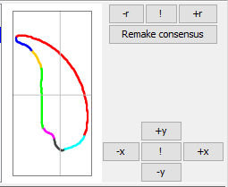
```

If a single dataset is selected, the display shows the segmented outline of the nucleus. If multiple datasets are selected, the outline and fill is shown in the dataset's preferred colour:

```{r, out.width="100%", out.height="100%", fig.align='center', echo=F}
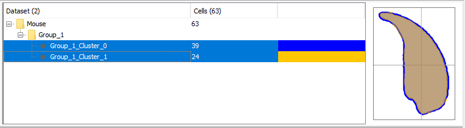
```

### Adjusting the consensus nucleus {#consensus-adjust}

When a single dataset is selected, options are available to adjust the rotation and position of the consensus nucleus. In the figure above, the controls are shown on the right of the consensus panel.

Control|Action
-------|-------
```+r, -r``` | rotate 1 degree clockwise or anti-clockwise about the centre of mass
```!``` | reset the rotation to use the landmarks in the ruleset for orientation
```+x, -x, +y, -y``` | adjust the position of the nucleus by one pixel in the given direction
```!``` | reset the centre of mass to position 0,0.

Rotation and offsets can also be applied in exact amounts using the options at the bottom of the right-click menu on the consensus chart: `Rotate by..` and `Offset...`

## Analysis info tab {#analysis-info-tab}

This contains the analysis parameters used to detect nuclei. If multiple datasets are selected, the background to each row will be green if all datasets have the same value, otherwise, the row will be white.

## Images tab {#images-tab}

Shows the images in which nuclei have been detected. The detected nuclei are highlighted with a yellow outline.

If image files have been moved, you can relocate them by double clicking the image folder and choosing the updated folder location.

## Cells tab {#cells-tab}

This displays information on individual cells within a dataset. On the left is a list of all cells within the population. 

The image channels with detected features (nucleus, FISH signals) can be switched between using the box on the lower left, under the cell list.

When a cell is selected, the source image will be displayed, with annotations for the centre of mass, segments, landmarks, and any FISH signals.

The orientation of the nuclei can be toggled using the `Orient` checkbox between actual (the same orientation as in the original image), and oriented (aligned according to the dataset rulesets).

Here is the outline displaying the image with the nucleus:

```{r, out.width="48%", out.height="48%", fig.show='hold', echo=F}
knitr::include_graphics("img/Cell_panel_regular.png")
knitr::include_graphics("img/Cell_panel_oriented.png")
```

The centre of mass is a pink diamond.
The landmarks are grey diamonds on the nuclear outline. Hover the mouse over them to see their names.

Segment boundaries and landmark positions can be updated. When you hover the mouse over the outline, a blue dot will be displayed. Click at any point to set it as a landmark or segment start location:

```{r, out.width="100%", out.height="100%", fig.show='hold', echo=F}
knitr::include_graphics("img/gifs/Edit_cell.gif")
```

This is a dataset with a FISH signal, showing the nucleus and signal channels. The outline and centre of mass of the FISH signal is shown in red:

```{r, out.width="48%", out.height="48%", fig.show='hold', echo=F}
knitr::include_graphics("img/Cell_panel_FISH_nucleus.png")
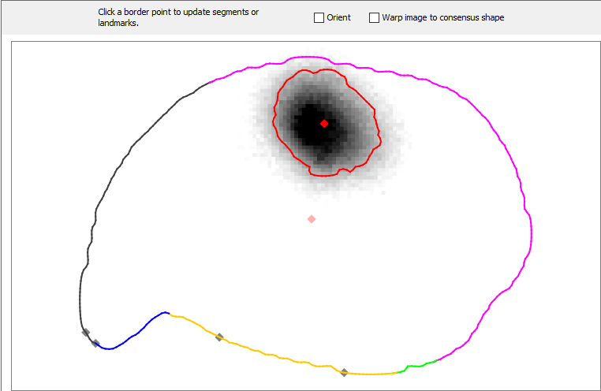
```

## Nuclear charts tab {#nuclear-charts-tab}

Measurements of nuclei within and between selected datasets

Tab | Contains
-----|------
Measurements | Mean, median, standard error of the mean, coefficient of variation and 95% confidence intervals for nuclear measurements
Violin plots | This tab shows information on [nuclear measurements](#measurements) for selected datasets in a series of violin and boxplots. The colour of each series in the boxplot reflects the dataset colour in the [populations panel](#populations-panel). To change colours, double click the dataset colour in the populations panel. 
Wilcoxon | This tab shows the results of pairwise Wilcoxon rank sum tests (a.k.a. Mann-Whitney U-tests) of population medians for each of the nuclear parameters, with Bonferroni correction for multiple testing. P-values significant at the 5% and 1% are highlighted in yellow and green respectively
Magnitude | This shows the pairwise magnitude differences between datasets, to give a feel for the biological significance of any differences detected between samples. If a single dataset is selected, the 'Random sampling' button is active, and opens the random sampler.
Scatter | Allows comparisons between two parameters, via the drop down lists. The Spearman's rank correlation coefficient for each selected dataset is given in the table to the left. The nuclei can be [filtered](#filtering-cells-method) using the 'Filter visible' button. 

## Nuclear profiles tab {#nuclear-profiles-tab}

The profiles tab displays the morphological profiles calculated for datasets. It contains the following tabs:

+----------------+--------------------------------------------------------------+
| Tab            | Contains                                                     |
+================+==============================================================+
| Angle profile  | Calculated by measuring the angle between the three border points from the point `window size` pixels behind to this point, to the point `window size` pixels ahead of this point.
+----------------+--------------------------------------------------------------+
| Diameter profile | The distance from each border point, through the centre of mass of the nucleus, to the opposite border. Expressed as a fraction of the maximum diameter.
+----------------+--------------------------------------------------------------+
| Radius profile | The distance of each border point from the centre of mass
+----------------+--------------------------------------------------------------+
| Variability    | The variability plot shows the size of the interquartile range along the median profile, and therefore shows the regions of the profile that are most variable within the dataset. The drop-down list at the top allows the variabilty of each profile type to be selected
+----------------+--------------------------------------------------------------+


If a single dataset is selected in the [populations panel](#populations-panel), the profile tab displays the profiles for all nuclei in the dataset in light grey, the segmented median profile in the chosen palette colours, and the interquartile range about the median in dark grey.

If multiple datasets are  selected in the populations panel, the profile tab displays the median profile in the chosen dataset colour, and the interquartile range about the median in alighter shade of the dataset colour. 

At the top of the chart are display options:

- `Normalised`: when ticked, all profiles are stretched to the same length. When unticked, nucleus profiles are shown at their actual length, corresponding to the perimeter length of the nucleus (the median profile length is set to the median of the lengths of the nuclei in the dataset)
 - `Left`: if the displayed dataset(s) are not normalised, they are aligned to the left edge of the chart
- `Right`: if the displayed dataset(s) are not normalised, they are aligned to the right edge of the chart
- `Show annotations`: if selected, show segment and landmark names (only applies when a single dataset is selected)
- `Show nuclear profiles`: if selected, show individual nucleus profiles (only applies when a single dataset is selected)

## Nuclear signals tab {#nuclear-signals-tab}

This tab displays information relating to FISH signals.

### Overview {#nuclear-signals-overview-tab}

This shows a table with average information about each signal group that has been detected, and a chart with the outline of the consensus nucleus (if refolded) and approximate positions of each signal.

The signals from each nucleus are drawn as a dot at the centre of mass of each signal. Tick the 'Show signal radii' option to draw a translucent circle on each signal with an equal area to the measured signal. Hover the mouse over a signal to show the nucleus image from which it was detected.

Note - a more accurate mapping of signals onto the consensus can be achieved using signal warping.

Signal groups within a dataset can be merged together using the 'Merge signal groups' button. Merged signal groups do not affect the original signal groups - they duplicate the original signals and add them to a new group.

```{r, out.width="100%", out.height="100%", fig.show='hold', fig.align='center', echo=F}
knitr::include_graphics("img/Nuclear_signals_1_overview.png")
```

### Detection settings {#nuclear-signals-detection-tab}

This shows the settings that were used to detect each signal group in the dataset. Double click the signal group colour to change the colour.

### Signal counts {#nuclear-signals-counts-tab}

Displays the number of signals detected per nucleus. Datasets can be filtered to select nuclei with a given number of signals using the 'Filter nuclei' button.

### Violin plots {#nuclear-signals-violin-tab}

This shows violin and boxplots for each of the [signal measurements](#signal-measurements).

### Scatter  {#nuclear-signals-scatter-tab}

This allows scatter plot comparisons between signal measurements, with Spearman's rank correlation coefficients shown at the left. As with all scatter panels, the datasets can be filtered on visible values using the 'Filter visible' button.

### Shells  {#nuclear-signals-shells-tab}

Displays the resuls of shell analysis. Shell analysis can be run via 'Dataset' > 'Add' > 'Shell analysis of signals'. 

If the selected datasets contain a single signal group, the chart will display a bar chart of the percentge signal detected in each shell. If multiple signal groups with shell results are present, the chart will instead show a heat map, in which the intensity of each square corresponds to the percentage signal in each shell. You can think of it as looking at the bar charts from above.

The upper table shows whether the shell results are significantly different to a random distribution via a chi square test.

The lower table shows pairwise comparisons between any shell results in the selected datasets, again by chi square. The pairwise tests require the shell results to have the same number of shells. 

### Colocalisation  {#nuclear-signals-colocalisation-tab}

This shows the distances between closest signal pairs. For each signal group within a dataset, signal pairs are calculated using the following method:

1) Signals within a nucleus are identified

2) The distances between all signals of different groups is calculated as the distance between the centres of mass.

3) The pair with the shortest distance is recorded and removed.

4) The process repeats with the remaining signals

5) Any remaining unpaired signals are ignored and the paired distances are reported.

### Warping  {#nuclear-signals-warping-tab}

Displays the results of signal warping.

## Nuclear segments tab {#nuclear-segments-tab}

The segments tab displays information on the segments within the median profile of the selected dataset(s).

The violin plots tab shows the range of segment lengths in the desired scale for all selected populations. If multiple datasets are selected, they must have the same number of segments for a meaningful comparison to be made.

The Wilcoxon and Magnitude tabs show the Wilcoxon rank-sum testsfor pairwise comparisons between datasets for each segment, and the pairwise magnitude differences.

## Comparisons tab {#comparisons-tab}

The Venn tab compares overlaps in nuclei between datasets, presented as a table.It is primarily designed to allow comparison of different child datasets after filtering or clustering.

Detailed Venn presents the Venn data in a pairwise format, with more detailed breakdown of the numbers of shared and unshared nuclei.

## Clusters tab {#clusters-tab}

The clusters panel allows clustering and tree-building to be run on a dataset, and shows information on clustering analyses that have been run previously. When cluster groups are available, the analysis parameters for the groups are shown in the table.

```{r, out.width="100%", out.height="100%", fig.show='hold', echo=F}

```

## Merges tab {#merges-tab}

If a selected dataset is a merge of other datasets, this panel displays the analysis parameters of the source datasets. As with the main analysis info tab, matching values are highlighted in green for each row. It also allows you to extract the source datasets back out of the merge. See also [merge instructions](#merge-method).

```{r, out.width="100%", out.height="100%", fig.show='hold', echo=F}
knitr::include_graphics("img/Merge_panel.png")
```

## Editing tab {#editing-tab}

This allows segments and landmarks to be updated within root datasets. The consensus nucleus is displayed, with annotations for the landmarks. The landmarks are grey diamonds on the nuclear outline. Hover the mouse over them to see their names.

Segment boundaries and landmark positions can be updated. When you hover the mouse over the outline, a blue dot will be displayed. Click at any point to set it as a landmark or segment start location. All cells will be updated to their best fit to the new location:

```{r, out.width="100%", out.height="100%", fig.show='hold', echo=F}
knitr::include_graphics("img/gifs/Edit_dataset.gif")
```

If you want to merge or split segments, use the buttons at the top of the panel. Merged segments can be unmerged; the unmerge button will be greyed out unless there are merged segments available.

### Angle window size explorer

If you want to see the effect of changing angle window sizes, click `Explore window size`. This will open a new window that allows the effects of altering the angle profile window size to be simulated across a range of values. No changes will be made to your actual dataset.

Enter the smallest angle window size to test (`0-1`), the largest to test (`0-1`), and the step size between them, then click run. The angle profiles generated for each of the window sizes will be displayed on the chart. The profile colours form a gradient from blue (lowest window size) to red (highest window size):

```{r, out.width="100%", out.height="100%", fig.show='hold', echo=F}
knitr::include_graphics("img/Window_size_explorer.png")
```

If you want to change the window size in your actual dataset, click the `Set window size` button.

<!--chapter:end:04-ui.Rmd-->

