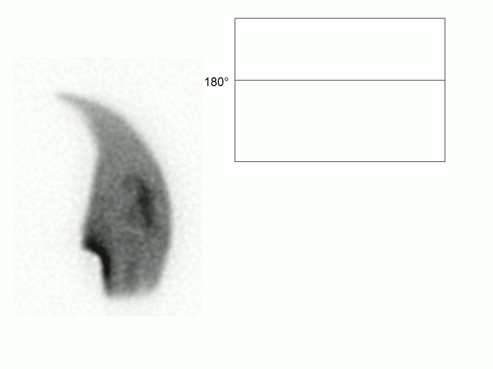
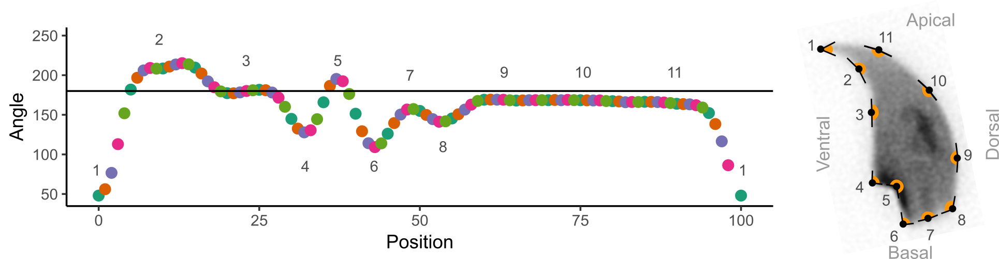
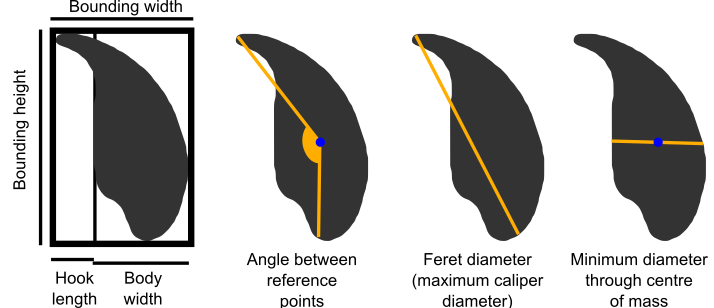

--- 
title: "Nuclear Morphology Analysis User Guide"
author: "Ben Skinner"
date: "`r Sys.Date()`"
site: bookdown::bookdown_site
output: 
  bookdown::gitbook:
    css: style.css
    config:
      search:
        engine: lunr
      sharing:
        facebook: false
        twitter: false
        all: false
    split_by: section
  bookdown::markdown_document2:
    base_format: rmarkdown::md_document
    variant: gfm
    split_by: section
documentclass: book
biblio-style: apalike
link-citations: yes
description: "User guide for Nuclear Morphology Analysis"
---

# Introduction

This is the help and documentation for Nuclear Morphology Analysis version ${project.version}, scientific image analysis software for studying nuclear morphology and nuclear organisation in cells with asymmetric nuclei.

This section covers the basic principle of the analyses, and what we can measure.

## Angle profiling

The method for morphological analysis, described in [our paper](https://academic.oup.com/biolreprod/advance-article/doi/10.1093/biolre/ioz013/5315749), allows us to automatically identify nuclei in microscopy images, and then find key landmarks for orientation and measurement. This is performed by generating an _angle profile_, that describes the shape of the nucleus by measuring internal angles around its perimeter:

```{r, out.width="50%", out.height="50%", echo=F, fig.align='center'}

```

No matter the orientation of the nucleus in the image, we can see features such as the hook and the tail attachment point show up show up in the profile:

```{r, out.width="90%", out.height="90%", echo=F, fig.align='center'}

```

Local minima and maxima define corners in the nuclear outline, and allow the key landmarks of interest to be found no matter the orientation of the nucleus. These profiles can then be aligned against each other. Here, we have angle profiles from ~400 mouse sperm nuclei aligned against each other, shown in grey, with the median of these values in the black line.

```{r, echo=F, message=F, warning=F, fig.height=3}
library(tidyverse)

parent.data <- readr::read_tsv("img/C57_CBA_stats.tsv") 

multi.profile.data <- parent.data %>%
  dplyr::filter(Dataset == "C57 3") %>%
  dplyr::select(CellID, starts_with("Angle_profile")) %>%
  tidyr::pivot_longer(-CellID, names_to="Profile_position") %>%
  dplyr::group_by(Profile_position) %>%
  dplyr::mutate(Position = as.numeric(gsub("Angle_profile_", "", Profile_position)),
                Median = median(value),
                Q25 = quantile(value, 0.25),
                Q75 = quantile(value, 0.75)) %>%
  dplyr::ungroup()

ggplot(multi.profile.data, aes(x=Position, y=value, group=CellID))+
  geom_hline(yintercept = 180)+
  geom_line(col="darkgrey")+
  geom_line(aes(y=Median), size=1.2)+
  labs(y="Angle")+
  theme_classic()
```

The median profile lets us get a good idea of the overall shape of the nuclei in a sample. We also get some idea of the variation in a population of sperm. If most nucleus profiles are very similar, there is little variation in shapes. If most nucleus profiles are very different to each other, there is a lot of variation in shapes. This can be visualised more easily by drawing the interquartile range of the angles, instead of every profile:

```{r, echo=F, message=F, warning=F, fig.height=3}
library(tidyverse)

ggplot(multi.profile.data, aes(x=Position))+
  geom_hline(yintercept=180)+ # The 180 degree line
  geom_ribbon(aes(ymin = Q25, ymax = Q75), alpha = 0.5)+ # the interquartile range; alpha is transparency
  geom_line(aes(y=Median), size=1.2)+ # the median line
  labs(x="Position", y="Angle")+
  coord_cartesian(ylim = c(50, 250))+
  theme_classic()
```

## What we measure in nuclei {#measurements}

In addition to the shape profiles, these values are automatically calculated for nuclei and displayed in the [Nuclear charts tab](#nuclear-charts-tab).

Measurement | Dimension | Formula | Description
----------|------|------|------------
Area | Area | | the two dimensional area of the nucleus
Perimeter | Length | | the length of the nuclear perimeter
Max feret | Length | | the maximum caliper diameter across the nucleus
Min diameter | Length | | the shortest diameter through the centre of mass of the nucleus
Variability | Angle | | the square root of the sum-of-squares difference at each index between between the nuclear profile and the dataset median profile, normalised to the length of the median profile.
Ellipticity | None | `H/W` | the height divided by width of the nuclear bounding box in the vertically oriented nucleus
Aspect ratio | None | `W/H` | the inverse of ellipticity
Elongation | None | (`H-W`)/(`H+W`) | the bounding height minus the bounding width, divided by the bounding height plus the bounding width
Regularity | None | (`pi*H*W`)/(`4*area`) | A measure of how regular the shape is; does it have rotational symmetry
Circularity | None | ```(4*pi*area)/(perimeter^2)``` | the closeness of the nucleus to a circle, between 0 and 1, where 1 is a perfect circle.
Bounding width | Length | | the width of the bounding rectangle of the nucleus, after rotation to vertical
Bounding height | Length | | the height of the bounding rectangle of the nucleus, after rotation to vertical
Length of hook [rodent sperm only] | Length | | the distance from the vertical region defined by the top and bottom vertical points to the lower x-edge of the bounding rectangle of the vertically oriented nucleus
Width of body [rodent sperm only] | Length | | the distance from the vertical region defined by the top and bottom vertical points to the upper x-edge of the bounding rectangle of the vertically oriented nucleus

```{r, out.width="100%", out.height="100%", fig.show='hold', echo=F}

```

## What we measure in FISH signals {#signal-measurements}

These values are automatically calculated for FISH signals and displayed in the [Nuclear signals tabs](#nuclear-signals-tab)

Statistic | Dimension | Description
----------|------|------------
Area | Area | the area of the signal
Perimeter | Length | the length of the nuclear perimeter
Angle | Angle | the angle of the signal from the orientation point
Distance from CoM (centre of mass) | Length | the absolute distance of the signal centre of mass from the nucleus centre of mass. The centre of mass is similar to the centroid, but weighted by pixel intensities
Fractional distance from CoM | Fraction | the distance from CoM as a propotion of the total distance from the nucleus CoM through the signal CoM to the nucleus border
Radius | Length | the radius of the circle that has the same area as the signal

## Citing and contact

If you use the software, please cite an appropriate paper:

For the morphological analysis:

[Skinner BM, Rathje CC, Bacon J, Johnson EEP, Larson EL, Kopania EEK, Good JM, Yousafzai G, Affara NA, Ellis PJI. A high-throughput method for unbiased quantitation and categorisation of nuclear morphology. _Biol Reprod_ 2019. doi:10.1093/biolre/ioz013.](https://www.ncbi.nlm.nih.gov/pmc/articles/PMC6497523/)

For signal warping:

[Skinner BM, Bacon J, Rathje CC, Larson EL, Kopania EEK, Good JM, Affara NA, Ellis PJI. Automated Nuclear Cartography Reveals Conserved Sperm Chromosome Territory Localization across 2 Million Years of Mouse Evolution. _Genes_ 2019; 10:109. doi:10.3390/genes10020109](https://www.ncbi.nlm.nih.gov/pmc/articles/PMC6409866/)

Find my current contact details [here](https://bitbucket.org/bmskinner/nuclear_morphology/wiki/Frequently%20Asked%20Questions)
